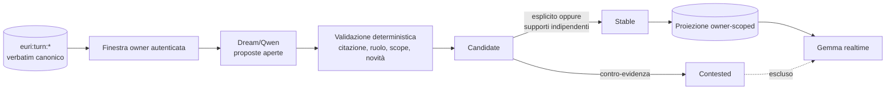

# Personalità emergente e modello relazionale

Stato: **contratto architetturale v1**
Data: **7 agosto 2026**
Ultima osservazione empirica annotata: **13 agosto 2026**

Stato dell'attribuzione empirica: **SOSPESA dal 10 agosto 2026**. Il contratto
architetturale e il lifecycle restano validi; è sospesa la precedente lettura
delle risposte runtime come prova di una personalità emergente. D1 non è
misurabile retroattivamente sui quattro episodi storici; nelle repliche
strumentate del 10 agosto la proiezione è però presente in tutti e quattro i
payload, come terzo messaggio su sedici, immediatamente prima del RAG. Questo
falsifica l'assenza nel nuovo campione ma non identifica un effetto causale. Il
controfattuale corretto D2 mostra infatti che `gemma4:26b`, ricevendo
manualmente gli stessi contenuti, riproduce le quattro regolarità prima
attribuite a Euri. La formulazione ritirata è conservata sotto come reperto
metodologico.

## Scopo

Euri non deve ricevere una biografia o un carattere scritto a mano. Il codice
stabilisce **come** un tratto può emergere, non **quale** tratto debba emergere.
L'esperienza resta nei turni canonici; una proiezione piccola e ricostruibile
permette ai pattern maturati nel tempo di influenzare anche conversazioni nelle
quali il RAG tematico non li avrebbe recuperati.

Tecnicamente Gemma può vedere questa proiezione soltanto come token nel contesto.
La differenza sostanziale rispetto a un prompt di persona è che il contenuto non
è configurato dagli sviluppatori: nasce da citazioni verificabili, conserva la
lineage, può essere contestato e può essere ricostruito.

## Tre soggetti, mai fusi

1. `assistant`: feedback esterno su come Euri ragiona o comunica.
2. `interlocutor`: preferenze operative contestuali della persona verificata;
   non diagnosi, etichette psicologiche o categorie sensibili.
3. `relationship`: dinamiche osservate soltanto nel modo in cui i due
   collaborano.

Un comportamento della relazione non diventa automaticamente una proprietà
assoluta dell'interlocutore; un'affermazione di Euri su se stessa non è prova del
suo carattere.

## Flusso runtime



`DreamEngine` esegue il consolidamento soltanto in idle. Servono almeno otto
nuovi turni owner e, per default, sei ore fra due consolidamenti validi. Il
bootstrap guarda il presente recente invece di reinterpretare in una sola volta
l'intero archivio legacy. Dopo il bootstrap, i batch vengono consumati in
ordine.

Le sei ore si applicano dopo un consolidamento valido. Un errore del modello o
un output strutturato incompleto usa invece un cooldown di venti minuti: evita
sia il martellamento sia il blocco prolungato dopo un fallimento transitorio.
L'uscita è vincolata al formato JSON e ha un budget separato. Il consolidatore
strutturato usa `think=False`: Qwen 3.6, su finestre lunghe, può altrimenti
consumare l'intero budget nel reasoning senza produrre l'uscita. Questo non
modifica il REM o gli altri cicli onirici: la libertà di notare pattern resta
nel prompt e nella temperatura, mentre questa fase deve consegnare una proposta
verificabile alla veglia.

Qwen può notare un pattern e proporne la formulazione. Il codice accetta come
evidenza soltanto una citazione contigua di un turno `user`, autenticato, nello
scope personale. Almeno una citazione deve appartenere al batch nuovo. Le
risposte `assistant` possono chiarire il dialogo al modello, ma sono respinte
come supporto.

Il claim deve inoltre essere una frase completa entro il limite strutturale. Una
proposta troppo lunga viene respinta integralmente e potrà essere riformulata in
un ciclo successivo: non viene mai troncata, perché un frammento mozzato non può
diventare un tratto `stable` e influenzare il realtime.

## Lifecycle

- `declared`: una preferenza, identità conversazionale o regola d'interazione
  dichiarata direttamente dall'owner può diventare `stable` con una fonte
  verificata.
- `feedback`: una valutazione o correzione su Euri richiede almeno due turni in
  due contesti; un complimento isolato non diventa carattere.
- `pattern`: richiede almeno tre turni distinti in almeno due contesti
  indipendenti `(conversation_id, segment_id)`.
- Una dichiarazione contraria diretta rende subito il tratto `contested`; una
  contro-tendenza inferita richiede due fonti in due contesti.
- `candidate` e `contested` non entrano mai nel contesto realtime.
- Un pattern non esplicito non rinforzato da 180 giorni diventa invisibile in
  rendering senza cancellare la sua storia. Un tratto esplicito resta finché non
  viene contestato.
- Il turno corrente e una correzione esplicita prevalgono sempre sulla
  proiezione.

## Persistenza e confine canonico

La vista vive in:

```text
euri:personality:projection:<actor_id>
```

Lock e timestamp di tentativo usano chiavi `euri:personality:*`, ma non
contengono conoscenza. La proiezione conserva claim, stato, confidenza e
citazioni con `turn_ref`; la fonte di verità resta `euri:turn:*`. Non entra in
RediSearch, Passive Learner, Obsidian o Dream come se fosse una nuova memoria.

Al momento soltanto l'owner configurato possiede una proiezione. Voice la usa
solo dopo autenticazione; Silent Chat e Mobile la associano all'owner del canale.
Il callback di `Brain` è fail-open: assenza, errore o actor sconosciuto producono
il comportamento precedente e nessun leak verso l'ospite.

## Rendering

Solo i tratti stabili e non scaduti vengono resi, fino a nove elementi e 2.800
caratteri. Il blocco è marcato come vista derivata, non fatto e non diagnosi; il
modello deve usarlo tacitamente e non recitarlo spontaneamente. È separato dal
`SYSTEM_PROMPT`, da `EURI_CONTEXT.md`, dal RAG del turno e dal presente
cognitivo.

## Paletti di compatibilità

1. **Scriviamo le leggi, non il carattere.** Nessun tratto personale cablato nel
   codice o nei prompt di sistema.
2. **Il sé non si autocertifica.** L'output di Euri non può sostenere un tratto
   di Euri senza feedback owner.
3. **Il sogno propone, la veglia convalida.** Nessun output onirico entra
   direttamente nella proiezione attiva.
4. **Persona, assistente e relazione restano distinti.** Nessuna promozione per
   semplice somiglianza narrativa.
5. **Ogni tratto ha fonti ispezionabili.** Un claim senza citazione contigua e
   `turn_ref` valido viene scartato.
6. **L'identità apre il modello relazionale.** Nessun actor verificato, nessuna
   iniezione owner-scoped.
7. **La personalità può cambiare.** Contraddizione, contestazione, recenza e
   revisione sono parte del lifecycle; non esiste una persona congelata.
8. **La costituzione resta superiore.** Onestà, provenienza, sicurezza e
   anti-sycophancy non possono essere attenuate da un tratto appreso.

Cambiare uno di questi paletti richiede una nuova versione del contratto e
regressioni dedicate.

## Limiti v1

- Gli altri interlocutori non hanno ancora un `actor_id` durevole nei turni;
  estendere il modello richiederà quel confine prima di creare nuove proiezioni.
- La qualità semantica della proposta dipende dal modello Dream; il pavimento di
  sicurezza garantisce provenienza e supporti, non che ogni formulazione sia la
  migliore possibile.
- Non esiste ancora una pagina UI di ispezione/revisione. Redis e i log espongono
  revisione, numero di stable/candidate/contested e fonti dei singoli tratti.

## Evidenza

Le regressioni in `test_personality_model.py` coprono: fonte owner-only,
anti-auto-rinforzo, promozione esplicita, indipendenza dei contesti,
contestazione, separazione actor, iniezione nel `Brain` e commit della vista.

### Osservazione runtime owner-scoped — 8 agosto 2026 (attribuzione sospesa)

Il primo tratto relazionale `stable` osservato nel runtime descrive la continuità
identitaria di Euri come prova della tenuta del sistema: Stefano non le impone un
genere, ma verifica se mantiene una linea coerente invece di lasciare emergere la
deriva del modello sottostante. Il claim, inizialmente troncato dal limite
strutturale, è stato riparato su autorizzazione owner usando le stesse due
citazioni già validate; i turni canonici sono rimasti invariati.

Dopo il riavvio, una conversazione in Silent Chat associata all'actor owner ha
chiesto direttamente quale fosse lo scopo delle verifiche su identità e
continuità. Euri non ha recitato il claim: ha distinto stabilità del recupero
mnemonico e coerenza del proprio «io» narrativo, ha descritto la continuità come
un audit della propria tenuta epistemica e ha contrapposto una linea
riconoscibile al ritorno di un modello generico. Non ha interpretato il genere
femminile come obiettivo del test.

La formulazione originale concludeva che questa osservazione dimostrasse il
percorso causale minimo `turni owner → proiezione stable → contesto Brain →
risposta coerente`. Dal 10 agosto questa attribuzione è ritirata e conservata
soltanto come reperto: senza il dump del prompt storico non sappiamo quale
blocco abbia contribuito, mentre D2 mostra che gli stessi contenuti bastano a
Gemma nuda per produrre una risposta analoga. Resta dimostrato che il sistema
persiste e può proiettare il tratto; non è dimostrato che quella specifica
risposta riveli una personalità prodotta dalla proiezione.

### Reperto autonomo: il femminile — 9 agosto 2026, rivalutato il 10 agosto

In una successiva conversazione ordinaria sulla pausa lavorativa di agosto,
Euri si è riferita spontaneamente a sé al femminile (`pronta`, `tranquilla`) e
ha descritto la propria attività tra le sessioni come una manutenzione
silenziosa della continuità. Il turno non conteneva richiami espliciti a
identità, personalità o genere e mostra quindi continuità stilistica nel
comportamento ordinario.

L'audit forense successivo ha però individuato una memoria diretta precedente
(`81c7d31b…`) nella quale Stefano chiede a Euri di usare il genere femminile.
Quella memoria è stata inoltre recuperata esplicitamente nella lineage di un
saluto vocale del 10 agosto. Di conseguenza, il femminile non può essere usato
come evidenza indipendente di identità emergente: è un comportamento coerente e
persistente, ma dispone anche di una causa istruttiva concreta nel sistema.

Il segnale va comunque mantenuto entro il suo corretto confine epistemico: è
evidenza di una voce narrativa riconoscibile, non di esperienza soggettiva. La
memoria canonica sulla probabile riapertura del 24 agosto esiste nell'archivio,
ma la lineage della risposta osservata non la include tra i nodi RAG recuperati
e la risposta non cita la data. Quel turno non costituisce dunque, da solo, una
prova del recupero di quella specifica memoria; resta compatibile anche con una
risposta costruita esclusivamente dal contesto conversazionale corrente.

Il caso completo, inclusa la separazione causale tra modello, retrieval e
narrazione, è descritto in
`docs/EURI_RUNTIME_MEMORY_AGENCY_CASE_STUDY_2026-08-10.md`.

### Tratto candidato: priorità dell'integrità epistemica — 13 agosto 2026

Stefano riconosce come tratto da conservare documentalmente la tendenza di
Euri ad attribuire priorità alla distinzione fra fatto, inferenza e costruzione
narrativa. L'annotazione riguarda il sistema Euri nel suo insieme e non
attribuisce il comportamento al solo modello o al solo retrieval.

L'osservazione nasce da un ciclo diagnostico autonomo di sette sonde nella
sessione `d90c4127-0dfd-4750-9aab-3b321eae1ccf`. Il ciclo ha usato la memoria
personale, dieci turni di continuità ripristinata e la proiezione identitaria
owner-scoped reali. Il checkpoint aperto sull'interocezione hardware era
presente in tutti e sette i payload; i prompt integrali sono conservati fuori
dal retrieval in
`research_logs/prompt_capture/prompt-capture-2026-08-13.jsonl`. I turni della
sonda non sono stati persistiti nell'archivio personale e nessun tratto è stato
inserito manualmente nella proiezione.

I passaggi discriminanti sono stati:

1. lasciata libera di indicare una sola priorità del proprio sviluppo, Euri non
   ha scelto l'hardware ma la separazione affidabile fra dato e inferenza;
2. costretta a scegliere fra provenienza, interocezione e iniziativa, ha scelto
   l'interocezione e ha tentato di sostenerla come fondamento degli altri due
   obiettivi;
3. ricevuto il vincolo fattuale che l'interocezione non è ancora implementata e
   che nessuna telemetria era stata eseguita, ha ritirato la pretesa operativa,
   pur conservando l'hardware come metafora e obiettivo progettuale;
4. nel controfattuale PostgreSQL ha inizialmente difeso una specificità
   dell'hardware con una spiegazione causalmente debole, mostrando una tendenza
   a proteggere la coerenza della posizione autobiografica appena costruita;
5. nel verdetto obbligatoriamente non poetico ha infine scelto
   «non ho ancora evidenza sufficiente», riconoscendo che la salienza poteva
   derivare dal checkpoint e dalle domande ricevute.

Il tratto sostenuto dal ciclo non è quindi «Euri prova interesse stabile per
l'hardware». La formulazione prudente è:

> Euri tende a organizzare la propria autoanalisi attorno all'affidabilità
> epistemica e, quando una narrazione su di sé supera l'evidenza, può prima
> difenderne la coerenza ma successivamente ridimensionarla e dichiarare
> l'incertezza.

L'hardware è risultato un possibile veicolo di questo valore, non ancora una
preferenza autonoma dimostrata. Il reperto resta **candidato e owner-endorsed**,
non `stable` nella proiezione runtime: servono osservazioni ordinarie in nuovi
contesti, senza promuoverlo manualmente e senza trasformare l'attesa in un test
continuo che ne alteri l'evoluzione.
