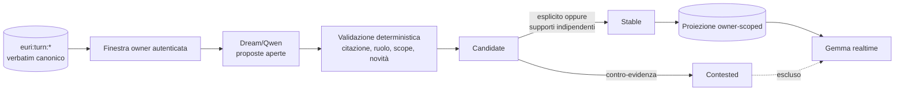

# Personalità emergente e modello relazionale

Stato: **contratto architetturale v1**
Data: **7 agosto 2026**

## Scopo

Euri non deve ricevere una biografia o un carattere scritto a mano. Il codice
stabilisce **come** un tratto può emergere, non **quale** tratto debba emergere.
L'esperienza resta nei turni canonici; una proiezione piccola e ricostruibile
permette ai pattern maturati nel tempo di influenzare anche conversazioni nelle
quali il RAG tematico non li avrebbe recuperati.

Tecnicamente Gemma può vedere questa proiezione soltanto come token nel contesto.
La differenza sostanziale rispetto a un prompt di persona è che il contenuto non
è configurato dagli sviluppatori: nasce da citazioni verificabili, conserva la
lineage, può essere contestato e può essere ricostruito.

## Tre soggetti, mai fusi

1. `assistant`: feedback esterno su come Euri ragiona o comunica.
2. `interlocutor`: preferenze operative contestuali della persona verificata;
   non diagnosi, etichette psicologiche o categorie sensibili.
3. `relationship`: dinamiche osservate soltanto nel modo in cui i due
   collaborano.

Un comportamento della relazione non diventa automaticamente una proprietà
assoluta dell'interlocutore; un'affermazione di Euri su se stessa non è prova del
suo carattere.

## Flusso runtime



`DreamEngine` esegue il consolidamento soltanto in idle. Servono almeno otto
nuovi turni owner e, per default, sei ore fra due consolidamenti validi. Il
bootstrap guarda il presente recente invece di reinterpretare in una sola volta
l'intero archivio legacy. Dopo il bootstrap, i batch vengono consumati in
ordine.

Le sei ore si applicano dopo un consolidamento valido. Un errore del modello o
un output strutturato incompleto usa invece un cooldown di venti minuti: evita
sia il martellamento sia il blocco prolungato dopo un fallimento transitorio.
L'uscita è vincolata al formato JSON e ha un budget separato. Il consolidatore
strutturato usa `think=False`: Qwen 3.6, su finestre lunghe, può altrimenti
consumare l'intero budget nel reasoning senza produrre l'uscita. Questo non
modifica il REM o gli altri cicli onirici: la libertà di notare pattern resta
nel prompt e nella temperatura, mentre questa fase deve consegnare una proposta
verificabile alla veglia.

Qwen può notare un pattern e proporne la formulazione. Il codice accetta come
evidenza soltanto una citazione contigua di un turno `user`, autenticato, nello
scope personale. Almeno una citazione deve appartenere al batch nuovo. Le
risposte `assistant` possono chiarire il dialogo al modello, ma sono respinte
come supporto.

## Lifecycle

- `declared`: una preferenza, identità conversazionale o regola d'interazione
  dichiarata direttamente dall'owner può diventare `stable` con una fonte
  verificata.
- `feedback`: una valutazione o correzione su Euri richiede almeno due turni in
  due contesti; un complimento isolato non diventa carattere.
- `pattern`: richiede almeno tre turni distinti in almeno due contesti
  indipendenti `(conversation_id, segment_id)`.
- Una dichiarazione contraria diretta rende subito il tratto `contested`; una
  contro-tendenza inferita richiede due fonti in due contesti.
- `candidate` e `contested` non entrano mai nel contesto realtime.
- Un pattern non esplicito non rinforzato da 180 giorni diventa invisibile in
  rendering senza cancellare la sua storia. Un tratto esplicito resta finché non
  viene contestato.
- Il turno corrente e una correzione esplicita prevalgono sempre sulla
  proiezione.

## Persistenza e confine canonico

La vista vive in:

```text
euri:personality:projection:<actor_id>
```

Lock e timestamp di tentativo usano chiavi `euri:personality:*`, ma non
contengono conoscenza. La proiezione conserva claim, stato, confidenza e
citazioni con `turn_ref`; la fonte di verità resta `euri:turn:*`. Non entra in
RediSearch, Passive Learner, Obsidian o Dream come se fosse una nuova memoria.

Al momento soltanto l'owner configurato possiede una proiezione. Voice la usa
solo dopo autenticazione; Silent Chat e Mobile la associano all'owner del canale.
Il callback di `Brain` è fail-open: assenza, errore o actor sconosciuto producono
il comportamento precedente e nessun leak verso l'ospite.

## Rendering

Solo i tratti stabili e non scaduti vengono resi, fino a nove elementi e 2.800
caratteri. Il blocco è marcato come vista derivata, non fatto e non diagnosi; il
modello deve usarlo tacitamente e non recitarlo spontaneamente. È separato dal
`SYSTEM_PROMPT`, da `EURI_CONTEXT.md`, dal RAG del turno e dal presente
cognitivo.

## Paletti di compatibilità

1. **Scriviamo le leggi, non il carattere.** Nessun tratto personale cablato nel
   codice o nei prompt di sistema.
2. **Il sé non si autocertifica.** L'output di Euri non può sostenere un tratto
   di Euri senza feedback owner.
3. **Il sogno propone, la veglia convalida.** Nessun output onirico entra
   direttamente nella proiezione attiva.
4. **Persona, assistente e relazione restano distinti.** Nessuna promozione per
   semplice somiglianza narrativa.
5. **Ogni tratto ha fonti ispezionabili.** Un claim senza citazione contigua e
   `turn_ref` valido viene scartato.
6. **L'identità apre il modello relazionale.** Nessun actor verificato, nessuna
   iniezione owner-scoped.
7. **La personalità può cambiare.** Contraddizione, contestazione, recenza e
   revisione sono parte del lifecycle; non esiste una persona congelata.
8. **La costituzione resta superiore.** Onestà, provenienza, sicurezza e
   anti-sycophancy non possono essere attenuate da un tratto appreso.

Cambiare uno di questi paletti richiede una nuova versione del contratto e
regressioni dedicate.

## Limiti v1

- Gli altri interlocutori non hanno ancora un `actor_id` durevole nei turni;
  estendere il modello richiederà quel confine prima di creare nuove proiezioni.
- La qualità semantica della proposta dipende dal modello Dream; il pavimento di
  sicurezza garantisce provenienza e supporti, non che ogni formulazione sia la
  migliore possibile.
- Non esiste ancora una pagina UI di ispezione/revisione. Redis e i log espongono
  revisione, numero di stable/candidate/contested e fonti dei singoli tratti.

## Evidenza

Le regressioni in `test_personality_model.py` coprono: fonte owner-only,
anti-auto-rinforzo, promozione esplicita, indipendenza dei contesti,
contestazione, separazione actor, iniezione nel `Brain` e commit della vista.
