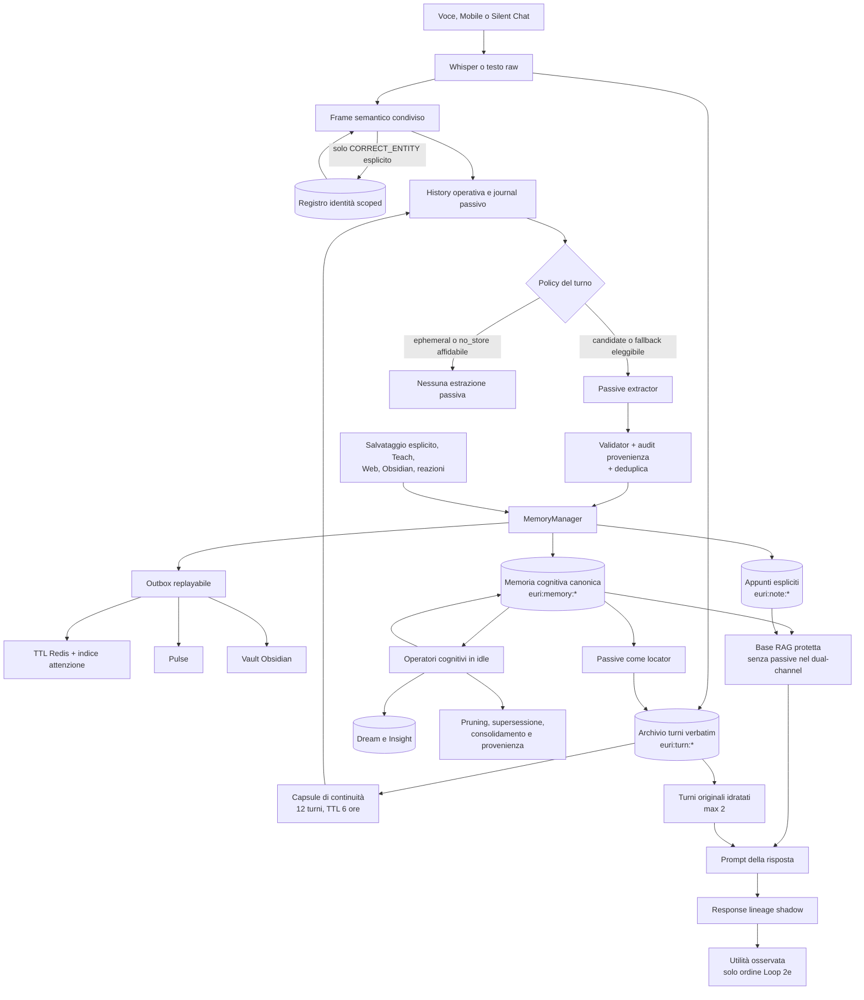
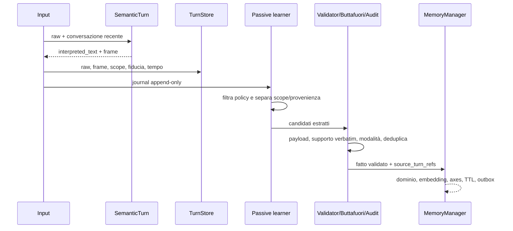
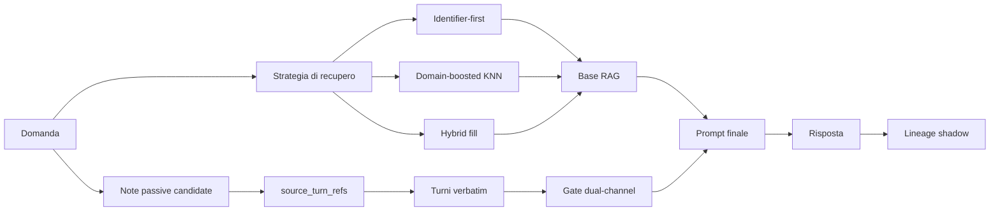
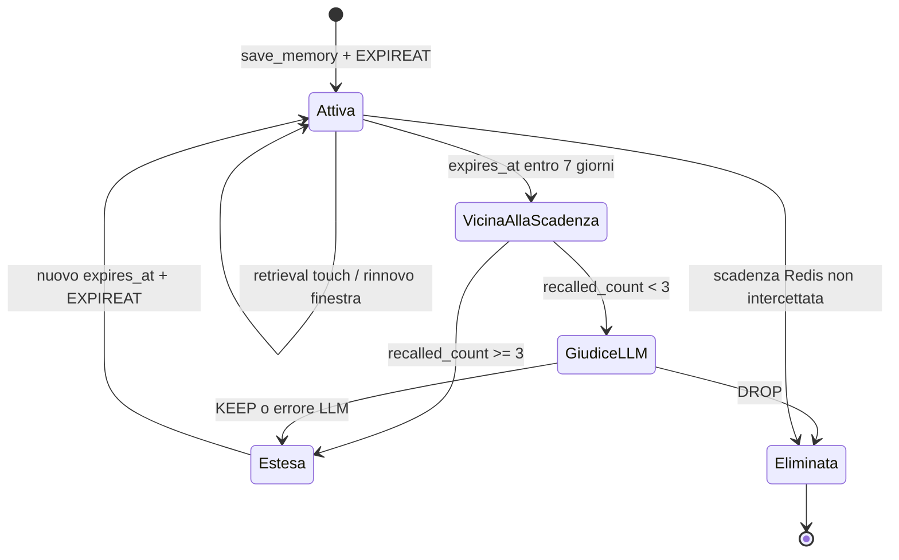

# Architettura mnemonica di Euri

Stato: **mappa canonica del comportamento corrente**

Verificata contro il codice: **4 agosto 2026**

Versione runtime di riferimento: **V2.22**

## Contratto di manutenzione

Questo documento è il punto di partenza obbligatorio per capire o modificare la
memoria di Euri. Evita di ricostruire ogni volta l'architettura leggendo moduli
sparsi.

- Prima di diagnosticare o cambiare memoria, continuità, RAG, Dream Engine,
  correzioni o Obsidian, leggere questa pagina.
- Il codice resta l'autorità eseguibile. Se codice e documento divergono, il
  comportamento osservato va verificato nel codice e questa pagina va corretta
  nello stesso intervento.
- Ogni modifica a tipi di memoria, TTL, stati, scope, provenienza, retrieval,
  consolidamento o chiavi Redis deve aggiornare questa pagina.
- Usare nomi di moduli e simboli, non numeri di riga destinati a diventare
  obsoleti.

Questa pagina descrive **che cosa esiste, da dove nasce, chi lo usa e come
muore**. Gli esperimenti e le misure restano nei documenti dedicati.

## 1. Mappa in una pagina



La distinzione fondamentale è questa:

1. **Il turno verbatim è la fonte storica.** Prova che una frase è stata
   pronunciata, non che sia ancora vera.
2. **Il frame semantico è una vista operativa additiva.** Può interpretare il
   raw, ma non lo sostituisce.
3. **La capsule è presente temporaneo.** Non è memoria a lungo termine.
4. **`euri:memory:*` è memoria cognitiva recuperabile.** Ha provenienza, rischio,
   uso e lifecycle propri.
5. **Indici, lineage, Pulse e Vault sono proiezioni o repliche.** Non devono
   diventare silenziosamente una seconda verità canonica.

## 2. I piani di memoria

| Piano | Persistenza | Fonte di verità | Funzione | Può entrare nel prompt? |
|---|---:|---|---|---|
| Presente cognitivo | secondi/minuti, in processo | stato runtime | presenza, focus e pending immediati | sì, come stato corrente |
| Continuità conversazionale | 6 ore, max 12 turni per scope | puntatori Redis verso i turni | ripristina il filo dopo un riavvio | sì, come contesto temporaneo |
| Archivio turni | durevole, senza TTL | `euri:turn:*` | evidenza raw indirizzabile e cronologica | sì, tramite history o dual-channel |
| Memoria cognitiva | variabile per sorgente | `euri:memory:*` | fatti, episodi, riflessioni, lezioni e consolidati | sì, tramite RAG |
| Appunti espliciti | durevole, senza TTL automatico | `euri:note:*` | note scoped cercate separatamente | sì, tramite keyword RAG |
| Registro identità | durevole, separato per scope | `euri:semantic:entity*` | alias confermati esplicitamente | influenza l'interpretazione, non entra come nodo RAG |
| Dream e insight | lifecycle proprio | `euri:dream:*`, `euri:insight:*` | ipotesi e connessioni interne | solo gli insight ammessi dal loro stato |
| Vault Obsidian | durevole su filesystem | replica umana bidirezionale | consultazione e modifica manuale | rientra via watcher come `obsidian_vault` |
| Indici e telemetria | ricostruibile o osservativa | JSON canonici ed eventi | ranking, replay, audit e misure | no, salvo il loro effetto sul ranking |

### Presente cognitivo

`core/cognitive_present.py` mantiene lo stato di secondi e minuti. È separato
dalla memoria a lungo termine. Gli snapshot sensoriali o sociali non diventano
fatti mnemonici soltanto perché sono presenti in questo stato.

### Continuità conversazionale

`core/conversation_continuity.py::ConversationContinuityStore` conserva per
scope un indice degli ultimi turni:

- chiavi `euri:continuity:v1:<scope>:*`;
- TTL predefinito 6 ore;
- massimo 12 turni;
- deriva focus, entità attive e fili aperti senza sintesi LLM;
- al boot reidrata il Brain, ma non riscrive l'archivio e non riattiva il
  passive learner;
- usa `interpreted_content` quando disponibile per derivare il workspace,
  mantenendo però il raw nel documento sorgente.

La capsule è una cache temporanea di puntatori. Backfill e turni già più vecchi
del TTL non diventano presente.

### Archivio verbatim

`core/conversation_turns.py::ConversationTurnStore` scrive documenti
`euri:turn:<conversation_id>:<seq>` idempotenti e senza TTL.

Campi essenziali:

- `content`: raw pronunciato o scritto;
- `interpreted_content`: vista additiva, se diversa;
- `semantic_frame`: interpretazione strutturata accettata;
- `trusted`, `speaker`, `observed_at`, `memory_scope`;
- `turn_ref`: identità stabile usata dalla provenienza.

Il lifecycle a 180 giorni è **audit-only**. Un turno non referenziato oltre il
grace period diventa candidato a revisione, ma il codice non lo cancella e non
gli assegna automaticamente un TTL.

## 3. Dal turno alla memoria passiva



### Il frame non salva

`core/semantic_turn.py` assegna a ogni turno:

- `memory_disposition`: `candidate`, `ephemeral` oppure `no_store`;
- per ogni fatto, `modality`: `asserted`, `probable`, `planned`, `pending` o
  `counterfactual`;
- per ogni fatto, `durability`: `reusable` oppure `session_only`.

Effetti:

- `candidate` rende il turno eleggibile; non crea una memoria;
- `ephemeral` e `no_store`, se il frame è affidabile, escludono sia il turno sia
  la risposta associata dal passivo;
- un frame assente o incerto è fail-open verso il validator preesistente;
- un fatto `reusable` informato impedisce che una label globale `ephemeral`
  incoerente lo faccia sparire;
- il raw viene archiviato comunque.

**Limite corrente:** `no_store` è una decisione per turno, non esiste ancora
una modalità persistente “questa intera conversazione è off-record”. Una frase
come “parliamo senza memorizzare” blocca quel turno, ma non costituisce da sola
un latch valido per tutti i turni successivi.

### Registro delle identità

`core/semantic_turn.py::EntityRegistry` è un registro durevole di supporto, non
una memoria cognitiva. Usa `euri:semantic:entity_aliases:<scope>` e
`euri:semantic:entity:<scope>:<id>`.

- soltanto una `CORRECT_ENTITY` esplicita del proprietario può scriverlo;
- una normale menzione o una proiezione del turno corrente non apprende alias;
- il registro canonicalizza interpretazione, query Web e history ancora
  in-flight, ma non riscrive il raw archiviato;
- non partecipa direttamente a RAG, Dream o TTL delle memorie.

### Gate del learner passivo

`voice_daemon.py::_passive_learner_loop` parte dopo circa 45 secondi di idle e:

1. legge il journal non ancora riconosciuto;
2. rende durevoli i turni prima di pubblicare riferimenti;
3. applica `frame_blocks_passive_memory`;
4. separa scope e segmenti rivolti/non rivolti a Euri;
5. estrae candidati;
6. applica validator, Buttafuori, audit di provenienza e deduplica;
7. salva soltanto i candidati sopravvissuti.

Un fatto owner-grounded nasce normalmente con:

- `source=passive`;
- `passive_support=owner_asserted`;
- `epistemic_status=user_asserted`;
- `requires_verification=false`;
- `temporal_context.source_turn_refs` verso il verbatim.

Parlato ambientale o supporto debole diventa invece
`passive_support=tacit_acceptance`, resta `requires_verification=true` ed è
escluso dal consolidamento Loop 2e.

## 4. Documento canonico `euri:memory:*`

`core/memory_manager.py::MemoryManager.save_memory` costruisce il documento
completo prima di pubblicarlo. RedisJSON è la fonte canonica; gli effetti
secondari passano da `core/memory_outbox.py` e sono replayabili.

| Gruppo | Campi principali | Significato |
|---|---|---|
| Identità | `id`, `content`, `source`, `memory_kind`, `memory_scope` | che nodo è e in quale mondo vive |
| Classificazione | `domain`, `category`, `tags`, `embedding` | recupero e organizzazione |
| Tempo | `created_at`, `asserted_at`, `event_start`, `event_end`, `expires_at` | salvataggio, affermazione, evento e scadenza |
| Uso | `recalled_count`, `last_recalled_at` | richiami cognitivi che possono rinnovare il TTL |
| Utilità osservata | `supported_use_count`, `last_supported_use_at` | segnale shadow per il solo ordine Loop 2e |
| Provenienza | `temporal_context.source_turn_refs`, `source_memory_ids`, `consolidated_from` | fonti verbatim o nodi genitori |
| Epistemica | `requires_verification`, `epistemic_status`, `passive_support`, `memory_axes` | solidità, modalità e rischi |
| Revisione | `superseded_by`, `consolidated_into`, `correction_pending`, `audit_flag`, `provenance_stale` | stato nel lifecycle e nei gate |

### Commit e outbox

Il salvataggio pubblica insieme il JSON canonico e un record outbox. Il consumer
applica in modo idempotente:

- `EXPIREAT` Redis, se esiste `expires_at`;
- indice derivato di attenzione Loop 2e;
- evento Pulse `memory/saved`;
- copia Markdown nel Vault.

Un errore in uno di questi effetti non annulla il JSON: l'outbox ritenta con
backoff. L'indice Loop 2e e il Vault non sono quindi autorità alternative.

## 5. Sorgenti, tipi e durata

La sorgente dice **come è nato** il nodo; `memory_kind` dice **che genere di
contenuto rappresenta**. Non sono la stessa dimensione.

| `source` | Origine tipica | TTL automatico alla nascita | Note |
|---|---|---:|---|
| `user` | salvataggio esplicito, impegno | nessuno | fuori dal pruning automatico per TTL |
| `teach` | insegnamento o documento acquisito | nessuno | include `document_summary` |
| `obsidian_vault` | file creato/modificato nel Vault | nessuno | ingresso deliberato dal watcher |
| `passive` | estrazione silenziosa dalla conversazione | 90 giorni | finestra scorrevole al richiamo |
| `conversation` | conoscenza/sommario conversazionale esplicito | 90 giorni | sorgente distinta dal verbatim |
| `episode` | episodio conversazionale | 7 giorni | il pruning usa almeno 30 giorni se molto richiamato |
| `web` | risultato o sintesi Web | 60 giorni | informazione temporalmente fragile |
| `reflection` | interpretazione interna | 90 giorni di default | Loop 2a forza 7 giorni alla nascita |
| `reaction` | lezione da correzione/reazione | nessuno | derivata, non fatto owner diretto |
| `loop2e` | consolidamento di più memorie | nessuno | conserva `consolidated_from` |
| `mobile_in` | acquisizione mobile diretta | nessuno | ammessa fra le fonti dirette del Dream |

Qualunque sorgente non presente in `_TTL_BY_SOURCE` non riceve una scadenza
automatica. “Senza TTL” non significa incancellabile: il nodo può ancora essere
superato, corretto, ritirato manualmente o eliminato da una procedura esplicita.

Eccezione importante: una reflection Loop 2a nasce con `expires_at` a 7 giorni,
ma un vero richiamo cognitivo usa la policy della sorgente `reflection` e le
assegna una nuova finestra di 90 giorni.

I `memory_kind` più importanti sono:

- `semantic_fact`: fatto riutilizzabile;
- `conversation_anchor`: ricorda l'esistenza di un filo, non il suo contenuto
  fattuale;
- `conversation_episode`: episodio contestuale;
- `reflection`: interpretazione interna;
- `reaction_lesson`: lezione derivata da una correzione;
- `derived_consolidation`: sintesi Loop 2e;
- `document_summary`: sintesi di un documento fornito dall'utente.

Gli impegni non vivono più in un archivio separato: sono memorie `source=user`
con `due_at` e `status=pending|done`. Gli appunti restano invece documenti
`euri:note:*`, senza embedding o lifecycle Dream, recuperati separatamente via
keyword e confinati dallo scope.

## 6. Recupero e uso



`core/rag_context.py` costruisce il contesto. Nel dual-channel:

- la base viene costruita escludendo `source=passive`;
- le note passive non entrano come testo sintetico;
- al massimo due note localizzano al massimo un turno ciascuna;
- `ConversationTurnStore.get` restituisce `content`, cioè il raw verbatim;
- se la fonte manca o appartiene a un altro scope, non viene aggiunto nulla;
- la modalità `selective` può promuovere davanti un verbatim ad alta rilevanza;
  altrimenti resta nell'append protetto.

Un retrieval con `touch=True` è l'evento che conta come richiamo:

- incrementa `recalled_count`;
- aggiorna `last_recalled_at`;
- rinnova `expires_at` e il TTL Redis secondo la sorgente;
- aggiorna l'indice di attenzione Loop 2e.

Essere soltanto presenti nel database non conta come uso. Le letture di audit
devono usare `touch=False`.

### Richiamo non equivale a utilità provata

`core/response_lineage.py` osserva quali nodi erano nel prompt.
`core/memory_utility_shadow.py` cerca evidenza lessicale distintiva nella
risposta e materializza `supported_use_count`.

Questo segnale:

- **non** modifica il TTL;
- **non** incrementa `recalled_count`;
- **non** rende vero o eleggibile un nodo;
- rinforza soltanto, con peso e cap, l'ordine dei candidati già ammessi a Loop
  2e.

## 7. Lifecycle delle memorie con TTL



`core/dream_engine.py::_pruning_pass` è Loop 2d:

- guarda i nodi con scadenza entro 7 giorni;
- con `recalled_count >= 3` estende deterministicamente;
- per `0`, `1` o `2` richiami chiede `KEEP/DROP` al modello;
- `KEEP` rinnova la finestra standard della sorgente;
- un errore del giudice restituisce `KEEP` per sicurezza;
- `DROP` usa una cancellazione Redis reale, senza tombstone.

Per sorgenti con TTL inferiore a 30 giorni, il ramo deterministico usa un floor
di 30 giorni. Una rete di sicurezza elimina eventuali memorie
`passive/reflection/conversation` mai richiamate che abbiano perso il TTL Redis
ma conservino un `expires_at` già trascorso.

Il TTL Redis è la verità operativa. Se Euri resta spenta e nessun pass di
manutenzione gira prima della scadenza, Redis può eliminare il nodo senza che il
giudice Loop 2d lo rivaluti. Il Vault Markdown non viene cancellato
automaticamente insieme alla chiave Redis.

Conseguenze pratiche:

- inutilizzo **favorisce** il decadimento, ma non garantisce `DROP` perché il
  giudice può scegliere `KEEP`;
- un richiamo reale rinnova subito la finestra anche sotto soglia 3;
- tre richiami proteggono deterministicamente al pass di pruning e aprono la
  candidatura al consolidamento, se tutti gli altri gate sono superati.

## 8. Stati di revisione e visibilità

| Stato/campo | Significato | Effetto principale |
|---|---|---|
| nessun flag | nodo attivo | recuperabile secondo rilevanza e scope |
| `requires_verification=true` | informazione non confermata o fragile | demozione e nota prudente nel prompt |
| `correction_pending=true` | possibile bersaglio di correzione | escluso dal RAG e da Loop 2e finché risolto |
| `superseded_by=<id>` | nodo superato da un altro | escluso dal retrieval; conserva audit e reversibilità |
| `consolidated_into=<id>` | foglia già usata da Loop 2e | non rientra in Loop 2e/Dream, ma resta recuperabile |
| `audit_flag` | problema rilevato | demozione o esclusione dai gate più forti |
| `provenance_stale=true` | una fonte derivata è fragile o manca | demozione e richiesta di verifica; può auto-guarire |
| `epistemic_status=retracted_*` | ritiro esplicito di audit | normalmente accompagnato da `superseded_by` per l'esclusione effettiva |

La quarantena Markdown `.euri-quarantine/` è recuperabile e umana; non è un
meccanismo generale di ranking Redis. L'esclusione cognitiva deve essere
rappresentata anche nel documento canonico.

### Correzioni

`MemoryManager.save_correction_signal` crea `euri:correction:*` con TTL 30
giorni. Una correzione esplicita e ben localizzata può marcare subito il
bersaglio `correction_pending`; Loop 2g distingue poi:

- `bad_memory`: memoria sospetta, aumenta il controllo;
- `bad_reasoning`: possibile nuova `reaction_lesson`;
- `not_a_correction`: nessuna mutazione cognitiva;
- `ambiguous`: conserva prudenza.

I segnali `proposal_only` non hanno autorità per mutare da soli una memoria.

## 9. Operatori che trasformano la memoria

| Operatore | Trigger | Legge | Scrive o modifica | Natura |
|---|---|---|---|---|
| Passive learner | ~45 s idle | nuovi turni eleggibili | `source=passive` | acquisizione |
| Loop 2a | idle, checkpoint di sessione | memorie di sessione + correlate | `source=reflection`, inizialmente 7 giorni | interpretazione interna |
| Loop 2b | creative ~90 min | due semi diretti e puliti cross-domain | dream + insight candidate | generazione |
| Loop 2c | light/creative | insight candidate | hypothesis/promoted | valutazione |
| Loop 2d | maintenance | memorie vicine alla scadenza | estensione TTL o delete | mietitore |
| Loop 2e | maintenance, max 24 h | cluster stesso dominio, recall >=3 e recenti | `source=loop2e`, `consolidated_into` | consolidamento |
| Loop 2f | maintenance | coppie vicine nello stesso dominio | `superseded_by` o nota di confronto | revisione contraddizioni |
| Loop 2g | light | correction signals | flag, chiusura quarantena, reaction lesson | audit correzioni |
| Loop 2h | maintenance | archi 2f | reflection o ripristino arco errato | self-observation |
| Loop 2i | light | episodi causali distinti | insight hypothesis | ipotesi trasversale |
| Provenance propagation | light/maintenance | relazioni fra derivati e fonti | `provenance_stale`, verifica | integrità |
| Cleanup insight | maintenance | insight per stato/età/uso | demozione o delete | mietitore |

I dettagli sperimentali e le misure degli operatori sono in
[`OPERATORI_COGNITIVI_AUDIT_2026-07-29.md`](OPERATORI_COGNITIVI_AUDIT_2026-07-29.md).

### Gate dei sogni e del consolidamento

Il Dream creativo accetta come semi soltanto fonti dirette o deliberatamente
acquisite (`user`, `teach`, `passive`, `conversation`, `obsidian_vault`,
`mobile_in`) e rivalida il JSON. Esclude derivati, episodi non fattuali,
superseded, consolidati spesi, contestati, da verificare, rischiosi o senza
provenienza adeguata.

Loop 2e richiede almeno:

- scope `personal`;
- `recalled_count >= 3`;
- `last_recalled_at` entro 30 giorni;
- embedding presente;
- nessuna verifica, quarantena, supersessione o precedente consolidamento;
- almeno tre frammenti coerenti dello stesso dominio e soggetto.

Il nodo `loop2e` non ha TTL automatico. Le foglie conservano la provenienza
bidirezionale tramite `consolidated_from` e `consolidated_into`.

## 10. Scope: mondi che non devono contaminarsi

`core/memory_scope.py` separa:

- `personal`;
- `experiment_<nome>`;
- `invalid_scope` per valori malformati.

Turni, memorie, deduplica, RAG, dual-channel e history usano lo scope attivo.
Dream e operatori canonici consumano soltanto `personal`. Una sessione
sperimentale scade dopo 24 ore e torna allo scope personale senza cancellare i
dati sperimentali.

Lo scope separa i mondi; non stabilisce se una frase sia vera.

## 11. Obsidian: replica durevole, non garbage collector

`utils/obsidian_sync.py` sincronizza in entrambe le direzioni:

- Redis → Vault: ogni memoria e insight promosso produce Markdown;
- Vault → Redis: creazione o modifica può aggiornare/importare una memoria come
  `obsidian_vault`.

La scadenza o cancellazione Redis non rimuove automaticamente il file Markdown.
Per una bonifica completa occorre quindi trattare separatamente:

1. stato cognitivo Redis;
2. indice derivato;
3. copia Vault, preferibilmente spostandola in quarantena recuperabile;
4. eventuali derivati che citano il nodo.

## 12. Come diagnosticare senza ricostruire tutto

Ordine consigliato:

1. identificare il **turno raw** e il suo `turn_ref`;
2. confrontare `content`, `interpreted_content` e `semantic_frame`;
3. identificare la memoria e leggere `source`, `memory_kind`, `scope`,
   `temporal_context.source_turn_refs`, stati epistemici e TTL;
4. verificare quale percorso l'ha portata nel prompt: base RAG, passive locator,
   reflection o insight;
5. controllare lineage e touch prima di concludere che sia stata davvero usata;
6. seguire `superseded_by`, `consolidated_from`, `consolidated_into` e
   `source_memory_ids` prima di correggere un solo nodo;
7. controllare separatamente il Vault.

Comandi read-only principali:

```bash
./venv/bin/python scripts/audit_memory.py --report
./venv/bin/python scripts/audit_verbatim_lifecycle.py
./venv/bin/python scripts/audit_memory_utility_shadow.py
./venv/bin/python scripts/explain_insight_promotion.py <insight-id>
```

Non usare `scripts/audit_memory.py --delete`, `--fix-*`, `--backfill-*` o
`--apply` durante una diagnosi read-only.

## 13. Moduli responsabili

| Responsabilità | Modulo/simbolo principale |
|---|---|
| frame semantico e policy del turno | `core/semantic_turn.py` |
| history e risposta | `core/brain.py` |
| archivio verbatim | `core/conversation_turns.py::ConversationTurnStore` |
| continuità fra processi | `core/conversation_continuity.py` |
| orchestrazione passiva e Loop 2a | `voice_daemon.py` |
| documento memoria, ricerca e touch | `core/memory_manager.py::MemoryManager` |
| commit degli effetti derivati | `core/memory_outbox.py` |
| composizione RAG | `core/rag_context.py` |
| policy dual-channel | `core/dual_channel.py`, `core/dual_channel_gate.py` |
| rischio e visibilità | `core/memory_risk.py` |
| attenzione Loop 2e | `core/memory_attention.py` |
| lineage delle risposte | `core/response_lineage.py` |
| utilità shadow | `core/memory_utility_shadow.py` |
| scope mnemonico | `core/memory_scope.py` |
| operatori 2b-2g, 2i e lifecycle | `core/dream_engine.py` |
| self-observation 2h | `core/self_observation.py` |
| sincronizzazione Vault | `utils/obsidian_sync.py` |

## 14. Invarianti da non rompere

1. Il raw verbatim non viene riscritto da un'interpretazione.
2. Una capsule temporanea non diventa una memoria cognitiva.
3. Una nota passiva localizza la fonte; non sostituisce il verbatim come prova
   nel dual-channel.
4. Un richiamo, un uso sostenuto e una conferma esterna sono tre eventi diversi.
5. `supported_use_count` non cambia verità, TTL o gate.
6. `superseded_by` è preferibile alla cancellazione quando serve reversibilità.
7. I derivati dichiarano le fonti e vengono demossi se la provenienza si rompe.
8. Scope personale e sperimentale non si mescolano.
9. Outbox, indici, Pulse e Vault non diventano fonti canoniche concorrenti.
10. Una richiesta “non memorizzare” non va interpretata oltre l'autorità
    realmente implementata: oggi la policy è per turno.
