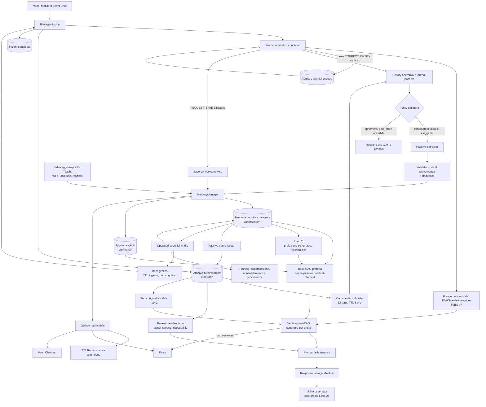
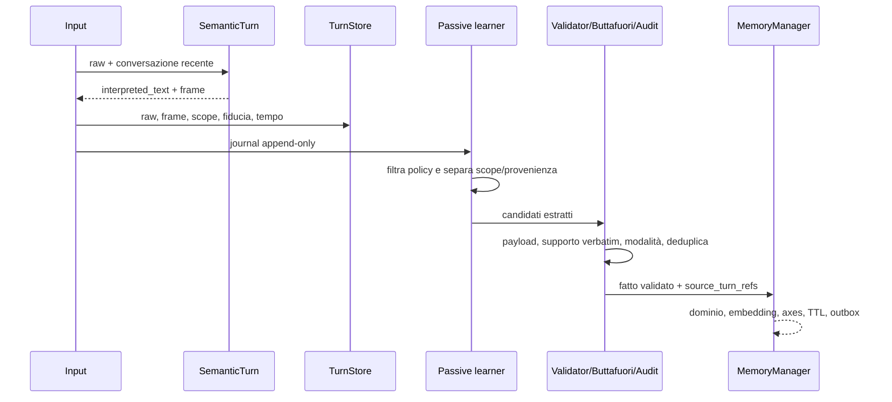
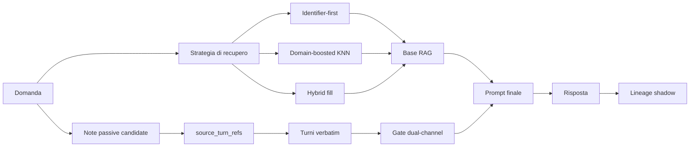
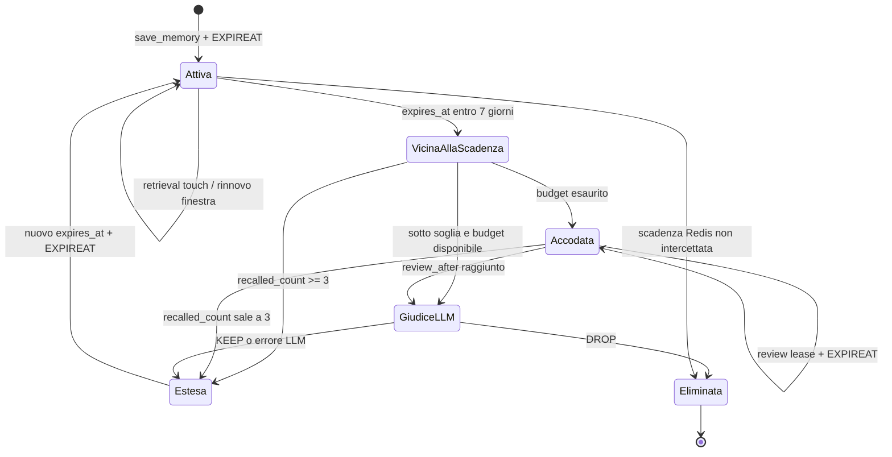

# Architettura mnemonica di Euri

Stato: **mappa canonica del comportamento corrente**

Verificata contro il codice: **19 agosto 2026**

Versione runtime di riferimento: **V2.24 — stato continuo al 19 agosto 2026**

## Contratto di manutenzione

Questo documento è il punto di partenza obbligatorio per capire o modificare la
memoria di Euri. Evita di ricostruire ogni volta l'architettura leggendo moduli
sparsi.

- Prima di diagnosticare o cambiare memoria, continuità, RAG, Dream Engine,
  correzioni o Obsidian, leggere questa pagina.
- Il codice resta l'autorità eseguibile. Se codice e documento divergono, il
  comportamento osservato va verificato nel codice e questa pagina va corretta
  nello stesso intervento.
- Ogni modifica a tipi di memoria, TTL, stati, scope, provenienza, retrieval,
  consolidamento o chiavi Redis deve aggiornare questa pagina.
- Usare nomi di moduli e simboli, non numeri di riga destinati a diventare
  obsoleti.

Questa pagina descrive **che cosa esiste, da dove nasce, chi lo usa e come
muore**. Gli esperimenti e le misure restano nei documenti dedicati.

## 1. Mappa in una pagina



La distinzione fondamentale è questa:

1. **Il turno verbatim è la fonte storica.** Prova che una frase è stata
   pronunciata, non che sia ancora vera.
2. **Il frame semantico è una vista operativa additiva.** Può interpretare il
   raw, ma non lo sostituisce.
3. **La capsule è presente temporaneo.** Non è memoria a lungo termine.
4. **`euri:memory:*` è memoria cognitiva recuperabile.** Ha provenienza, rischio,
   uso e lifecycle propri.
5. **Indici, lineage, Pulse e Vault sono proiezioni o repliche.** Non devono
   diventare silenziosamente una seconda verità canonica.
6. **La personalità emergente è una proiezione.** Conserva pattern sostenuti da
   turni verificati, ma la sua fonte di verità resta il verbatim.

Il modello conversazionale e quello cognitivo restano separati. La chat usa
`config.OLLAMA_MODEL` (`gemma4:26b` nell'installazione corrente); Dream Engine,
modello identitario e operatori idle usano esclusivamente
`config.DREAM_OLLAMA_MODEL`, attualmente
`hf.co/unsloth/Qwen3.8-27B-GGUF:Q4_K_M`. Il modello Dream e' sostituibile senza
toccare i call site tramite `EURI_DREAM_OLLAMA_MODEL`; il rollback operativo al
predecessore e' `EURI_DREAM_OLLAMA_MODEL=qwen3.6:35b` e ripristina anche il
profilo creativo storico. Con Qwen3.8, REM e wake usano rispettivamente
`DREAM_REM_*` e `DREAM_WAKE_*`: alta temperatura e contenuto diretto, senza
thinking nascosto. I judge di convergenza e qualita' mantengono il reasoning.
Per il profilo Qwen3.8 i judge profondi hanno una finestra di 600 secondi e un
solo nuovo tentativo per tipo a ciclo (`DREAM_DEEP_REASONING_TIMEOUT_S`,
`BRIDGE_VALIDITY_BUDGET`, `CONVERGENCE_JUDGE_BUDGET`). Un tentativo di bridge
consuma il budget anche quando termina in timeout. La telemetria per chiamata
riporta durata, motivo di arresto, token generati e dimensione separata di
reasoning/contenuto; gli override `EURI_*` permettono prove e rollback senza
riscrivere la policy.

## 2. I piani di memoria

| Piano | Persistenza | Fonte di verità | Funzione | Può entrare nel prompt? |
|---|---:|---|---|---|
| Presente cognitivo | secondi/minuti, in processo | stato runtime | presenza, focus e pending immediati | sì, come stato corrente |
| Workspace/artefatto documentale | 30 minuti, Redis + filesystem | documento attivo o turni reali selezionati | sorgente operativa per revisioni/generazioni TXT/DOCX/PDF | solo tramite tool; non come memoria RAG |
| Continuità conversazionale | 6 ore, max 12 turni per scope | puntatori Redis verso i turni | ripristina il filo dopo un riavvio | sì, come contesto temporaneo |
| Archivio turni | durevole, senza TTL | `euri:turn:*` | evidenza raw indirizzabile e cronologica | sì, tramite history o dual-channel |
| Memoria cognitiva | variabile per sorgente | `euri:memory:*` | fatti, episodi, riflessioni, lezioni e consolidati | sì, tramite RAG |
| Appunti espliciti | durevole, senza TTL automatico | `euri:note:*` | note scoped cercate separatamente | sì, tramite keyword RAG |
| Registro identità | durevole, separato per scope | `euri:semantic:entity*` | alias confermati esplicitamente | influenza l'interpretazione, non entra come nodo RAG |
| Proiezione identitaria | durevole e revisionata; pattern inferiti non espliciti diventano invisibili dopo 180 giorni senza rinforzo | `euri:turn:*`, referenziato da `euri:personality:projection:<actor_id>` | distilla sé, interlocutore e relazione senza riscrivere la memoria | sì, solo stable e actor verificato |
| Dream e insight | REM grezzo 7 giorni; insight con lifecycle proprio | `euri:dream:*`, `euri:insight:*` | esplorazione divergente separata da ipotesi e connessioni interne | il REM mai; solo gli insight ammessi dal loro stato |
| Proiezione schematica | generazioni TTL 3 giorni, ricostruita al boot e in maintenance | `euri:memory:*`, puntatore `euri:loop2j:current_generation` | collega memorie dirette per entità esplicite senza sintetizzare fatti | mai come nodo; può guidare il recupero delle fonti originali |
| Vault Obsidian | durevole su filesystem | replica umana bidirezionale | consultazione e modifica manuale | rientra via watcher come `obsidian_vault` |
| Indici e telemetria | ricostruibile o osservativa | JSON canonici ed eventi | ranking, replay, audit e misure | no, salvo il loro effetto sul ranking |

### Presente cognitivo

`core/cognitive_present.py` mantiene lo stato di secondi e minuti. È separato
dalla memoria a lungo termine. Gli snapshot sensoriali o sociali non diventano
fatti mnemonici soltanto perché sono presenti in questo stato.

### Proiezione identitaria emergente

`core/personality_model.py` legge finestre bounded dell'archivio turni e lascia
che il modello Dream proponga pattern aperti. La proposta non ha autorità: il
codice richiede citazioni owner contigue, scope personale, novità rispetto al
checkpoint e indipendenza dei supporti. Solo `stable` entra nel `Brain`; gli
stati `candidate` e `contested` restano osservabili ma inattivi.

La proiezione non è RAG, non è presente cognitivo, non entra in Obsidian e non
può usare una risposta di Euri come prova del carattere di Euri. Voice la lega
all'identità autenticata; UI e Mobile al canale owner. Il contratto completo e
i paletti di compatibilità sono in
[`EURI_EMERGENT_PERSONALITY.md`](EURI_EMERGENT_PERSONALITY.md).

### Artefatto documentale di sessione (non è memoria)

`core/document_workspace.py::DocumentWorkspace` conserva per 30 minuti in Redis il
manifest owner-scoped del tavolo documentale condiviso da UI e voce. I file reali
restano sul filesystem; Redis contiene selezione, testo estratto, path, hash,
versione, ricevute e stato dell'operazione corrente. La UI usa l'uploader già
esistente per PDF, DOCX, PPTX e gli altri formati: non esiste un secondo archivio
cognitivo.

- `context_extra` resta un estratto limitato destinato alla history del modello;
- ogni file letto è un artefatto distinto: più documenti non vengono concatenati
  come sorgente di una revisione;
- nel flusso Streamlit il registro `.silent_chat_uploads.json` è soltanto il control
  plane dell'uploader e non diventa mai un documento. Solo i path registrati dalla
  UI entrano nel workspace: gli altri file presenti nella cartella dati sono esclusi;
- l'ultimo upload diventa attivo, i precedenti formano una coda temporale limitata
  a 12 artefatti e la selezione manuale nel pannello può cambiare la precedenza;
- fuori dal flusso Streamlit, più file realmente letti senza un riferimento univoco
  restano ambigui e la modifica fallisce chiusa;
- voce e Silent Chat vedono lo stesso artefatto attivo tramite
  `euri:document_workspace:v1:<scope>`;
- `euri:document_workspace:v1:<scope>:operation` descrive soltanto il presente
  operativo (`running/completed/failed`, canale, file, tool ed esito). Nasce già
  all'upload, viene preso in carico dall'Executor e consente alla voce di osservare
  un lavoro UI concorrente senza fingere di averlo avviato o completato;
- `compose_document` usa la sorgente e la conversazione recente per risolvere
  richieste come “applica le modifiche suggerite”;
- il frame semantico può scegliere esplicitamente `active_document`,
  `recent_conversation` o `instruction_only`. Non esiste fallback implicito fra
  queste sorgenti. Per `recent_conversation`, l'Executor materializza
  `last_exchange`, `current_thread` o `recent_turns` dalla history reale e allega
  i `turn_ref` come provenienza; questa vista effimera non duplica né modifica
  l'archivio durevole dei turni;
- una trascrizione conserva i ruoli: le risposte di Euri sono interpretazioni o
  ipotesi, non fatti attribuibili a Stefano senza una sua conferma nei turni;
- un DOCX sorgente viene revisionato conservativamente su una copia: soltanto i
  paragrafi autorizzati cambiano e il controllo post-scrittura preserva sezioni,
  pagina, margini, header/footer, tabelle, stili e numero di paragrafi;
- l'hash della sorgente è un optimistic guard: se il file è cambiato dopo la
  lettura, la revisione viene rifiutata;
- TXT/PDF e documenti nuovi usano i renderer strutturali; ogni output va in
  `~/Scrivania/scambio_dati`, senza sovrascrittura, poi viene riaperto e validato;
- la conferma contiene una ricevuta reale (`filepath`, byte, SHA-256 e controlli di
  struttura). La voce pronuncia questa ricevuta deterministica e la UI la mostra
  entro due secondi con provenienza, anteprima e download diretto, anche quando
  non esiste un manifest di documenti caricati;
- l'artefatto non entra in `euri:memory:*`, non alimenta il passive learner e si
  perde alla scadenza. Il riavvio dei processi non lo cancella finché il TTL è vivo;
  una persistenza cognitiva richiede i normali percorsi SAVE/Teach.

### Continuità conversazionale

`core/conversation_continuity.py::ConversationContinuityStore` conserva per
scope un indice degli ultimi turni:

- chiavi `euri:continuity:v1:<scope>:*`;
- TTL predefinito 6 ore;
- massimo 12 turni;
- deriva focus, entità attive e fili aperti senza sintesi LLM;
- al boot reidrata il Brain, ma non riscrive l'archivio e non riattiva il
  passive learner;
- prima di ogni nuovo turno accettato, voce e Silent Chat eseguono un pull
  idempotente dei nuovi `turn_ref` creati dall'altro processo. I turni importati
  sono marcati `restored_context`: entrano nel prompt, non nel journal passivo;
- usa `interpreted_content` quando disponibile per derivare il workspace,
  mantenendo però il raw nel documento sorgente.

La capsule è una cache temporanea di puntatori. Backfill e turni già più vecchi
del TTL non diventano presente.

### Archivio verbatim

`core/conversation_turns.py::ConversationTurnStore` scrive documenti
`euri:turn:<conversation_id>:<seq>` idempotenti e senza TTL.

Campi essenziali:

- `content`: raw pronunciato o scritto;
- `interpreted_content`: vista additiva, se diversa;
- `semantic_frame`: interpretazione strutturata accettata;
- `trusted`, `speaker`, `observed_at`, `memory_scope`;
- `turn_ref`: identità stabile usata dalla provenienza.

Il lifecycle a 180 giorni è **audit-only**. Un turno non referenziato oltre il
grace period diventa candidato a revisione, ma il codice non lo cancella e non
gli assegna automaticamente un TTL.

## 3. Dal turno alla memoria passiva



### Il frame non salva da solo

`core/semantic_turn.py` assegna a ogni turno:

- `memory_disposition`: `candidate`, `ephemeral` oppure `no_store`;
- per ogni fatto, `modality`: `asserted`, `probable`, `planned`, `pending` o
  `counterfactual`;
- per ogni fatto, `durability`: `reusable` oppure `session_only`.

Effetti:

- `candidate` rende il turno eleggibile; non crea una memoria;
- `ephemeral` e `no_store`, se il frame è affidabile, escludono sia il turno sia
  la risposta associata dal passivo;
- un frame assente o incerto è fail-open verso il validator preesistente;
- un fatto `reusable` informato impedisce che una label globale `ephemeral`
  incoerente lo faccia sparire;
- il raw viene archiviato comunque.

Il frame può però **instradare** un'azione mnemonica esplicita. Se riconosce ad
alta confidenza `intent=SAVE_MEMORY` e `REQUEST_SAVE`, il dispatcher del canale
passa il turno a `core/save_service.py` prima di generare la risposta. Vale
anche per formulazioni naturali come una correzione seguita da “ricordalo”:

1. il frame propone l'intento condiviso;
2. l'arbitraggio può sostituire soltanto un altro intento appartenente alla
   stessa lista sicura, quindi non può promuovere un comando distruttivo;
3. il save service risolve il fatto nel contesto recente e committa davvero la
   memoria;
4. la risposta mostrata o pronunciata deriva dall'esito reale del commit.

Un salvataggio esplicito nasce con `source=user` ed è permanente. Se lo stesso
testo esiste già soltanto come nodo passivo o epistemicamente debole, il save
esplicito crea la versione autorevole e soft-supersede la precedente; l'uguaglianza
testuale non deve impedire la promozione di autorità. Il learner passivo può
continuare a osservare il turno, ma la deduplica vedrà il fatto già fissato e
non diventa il surrogato ritardato di un'azione richiesta dall'utente.

**Limite corrente:** `no_store` è una decisione per turno, non esiste ancora
una modalità persistente “questa intera conversazione è off-record”. Una frase
come “parliamo senza memorizzare” blocca quel turno, ma non costituisce da sola
un latch valido per tutti i turni successivi.

### Sessione TEACH: intenzione semantica e salvataggio autorizzato

Dal frame semantico versione 6, TEACH non è più attivabile dal semplice incontro
di formule come “ti racconto” o “ti spiego”. `core/intent_router.py` conserva
l'intento come destinazione del dispatcher, ma non contiene pattern lessicali che
lo autorizzino. Gemma deve riconoscere nello stesso turno un contratto completo:

- destinatario `assistant`;
- scopo `knowledge_transfer`;
- interazione `guided_session`;
- `INITIATE_TEACHING` e intento `TEACH` coerenti;
- evidenza letterale realmente contenuta nel turno e confidenza almeno 0,82.

Una richiesta di spiegare qualcosa a un collega o a un'altra persona resta CHAT;
un racconto ordinario resta CHAT; un salvataggio diretto resta SAVE_MEMORY. Se il
frame manca, il JSON semantico fallisce, il destinatario è incerto o il contratto
è incompleto, il gate chiude su CHAT: il fallback lessicale non può aprire la
modalità.

L'autorizzazione accompagna l'intera sessione. Gli snapshot di recupero usano uno
schema versionato e vengono ripristinati soltanto se contengono il contratto; i
vecchi snapshot testuali vengono scartati. Al read-back, una conferma positiva
può creare una memoria `source=teach` soltanto se esistono sia il riepilogo sia
l'origine didattica autorizzata. La conferma finale non può quindi sanare a
posteriori una conversazione entrata per errore in TEACH.

### Bisogno evidenziale e vuoti di conoscenza

Dal frame semantico versione 6, `core/semantic_turn.py` produce anche
`evidence_request`. Gemma decide semanticamente, senza classificatori regex, se
la risposta dipende da fatti ulteriori rispetto alle premesse del turno:

- `dependency=none`: le premesse bastano oppure non servono fatti esterni;
- `optional`: è possibile una risposta condizionale utile, ma dati ulteriori la
  renderebbero più precisa;
- `required`: una risposta specifica senza quei dati sarebbe inventata.

Il piano conserva separatamente premesse ammesse, entità coinvolte,
`missing_facts`, vincolo `memory_only` e fonti semanticamente adatte fra
proprietario, documenti aziendali e Web. Il validatore accetta soltanto entità
già ancorate nel frame e valori del contratto chiuso; non interpreta di nuovo le
parole dell'utente.

Dopo il RAG, `core/rag_context.py::apply_knowledge_gap_contract` confronta il
bisogno con i soli nodi realmente inseriti nel prompt. Il confronto usa le
`memory_axes.entity_mentions` già estratte e i gate epistemici delle memorie;
una reflection, un insight, un nodo contestato o da verificare non diventa prova
forte. Un nodo diretto pertinente resta comunque soltanto un candidato: la
risposta deve verificare che il suo contenuto sostenga proprio i dettagli
richiesti e non può estenderli per analogia.

Se manca copertura, il RAG aggiunge un contratto evidenziale: preserva le
premesse senza rafforzarle, vieta specifiche inventate e lascia a Gemma la
formulazione naturale di una domanda o proposta verso la fonte più adatta.
Stefano è quindi una fonte possibile; i documenti sono adatti ai dati aziendali;
il Web è adatto ai fatti pubblici, ma **non è un fallback automatico**. La
semplice rilevazione del gap emette il Pulse osservativo
`knowledge_gap_detected` e non cambia intento, non chiama tool e non autorizza
una ricerca.

Se nel turno successivo l'utente dice naturalmente «non lo so, controlla nel
web», il medesimo interprete usa la conversazione recente per ricostruire entità
e informazioni mancanti e produce `REQUEST_WEB_SEARCH` con una query autonoma.
Quella autorizzazione esplicita, non il Pulse precedente, abilita il percorso
Web già esistente. Con `memory_only=true` Euri dichiara invece l'assenza delle
informazioni senza offrire fonti esterne.

Voce e Silent Chat condividono la query del frame. La voce conserva il proprio
handler TTS; Silent Chat usa `core/web_search.py::answer_explicit_web_search` e
restituisce lo stesso tipo di sintesi senza TTS. In entrambi i casi una sintesi
riuscita viene salvata con `source=web`, TTL e `requires_verification` già
previsti per quella sorgente.

### Registro delle identità

`core/semantic_turn.py::EntityRegistry` è un registro durevole di supporto, non
una memoria cognitiva. Usa `euri:semantic:entity_aliases:<scope>` e
`euri:semantic:entity:<scope>:<id>`.

- soltanto una `CORRECT_ENTITY` esplicita del proprietario può scriverlo;
- una normale menzione o una proiezione del turno corrente non apprende alias;
- il registro canonicalizza interpretazione, query Web e history ancora
  in-flight, ma non riscrive il raw archiviato;
- non partecipa direttamente a RAG, Dream o TTL delle memorie.

### Gate del learner passivo

`voice_daemon.py::_passive_learner_loop` parte dopo circa 45 secondi di idle e:

1. legge il journal non ancora riconosciuto;
2. rende durevoli i turni prima di pubblicare riferimenti;
3. applica `frame_blocks_passive_memory`;
4. separa scope e segmenti rivolti/non rivolti a Euri;
5. estrae candidati;
6. applica validator, Buttafuori, audit di provenienza e deduplica;
7. salva soltanto i candidati sopravvissuti.

Un fatto owner-grounded nasce normalmente con:

- `source=passive`;
- `passive_support=owner_asserted`;
- `epistemic_status=user_asserted`;
- `requires_verification=false`;
- `temporal_context.source_turn_refs` verso il verbatim.

Parlato ambientale o supporto debole diventa invece
`passive_support=tacit_acceptance`, resta `requires_verification=true` ed è
escluso dal consolidamento Loop 2e.

## 4. Documento canonico `euri:memory:*`

`core/memory_manager.py::MemoryManager.save_memory` costruisce il documento
completo prima di pubblicarlo. RedisJSON è la fonte canonica; gli effetti
secondari passano da `core/memory_outbox.py` e sono replayabili.

| Gruppo | Campi principali | Significato |
|---|---|---|
| Identità | `id`, `content`, `source`, `memory_kind`, `memory_scope` | che nodo è e in quale mondo vive |
| Classificazione | `domain`, `category`, `tags`, `embedding` | recupero e organizzazione |
| Tempo | `created_at`, `asserted_at`, `event_start`, `event_end`, `expires_at` | salvataggio, affermazione, evento e scadenza |
| Uso | `recalled_count`, `last_recalled_at` | richiami cognitivi che possono rinnovare il TTL |
| Utilità osservata | `supported_use_count`, `supported_use_observed_recalled_count`, `last_supported_use_at` | riuso ed esposizione shadow per il solo ordine Loop 2e |
| Provenienza | `temporal_context.source_turn_refs`, `source_memory_ids`, `consolidated_from` | fonti verbatim o nodi genitori |
| Epistemica | `requires_verification`, `epistemic_status`, `passive_support`, `memory_axes` | solidità, modalità e rischi |
| Revisione | `superseded_by`, `consolidated_into`, `correction_pending`, `audit_flag`, `provenance_stale` | stato nel lifecycle e nei gate |
| Coda pruning | `pruning_review_pending`, `pruning_review_after`, `pruning_original_expires_at`, `pruning_defer_count`, `pruning_last_verdict` | lease, priorità e audit del giudizio Loop 2d |

### I tre tempi e le date ellittiche

Una memoria non possiede un solo timestamp:

- `created_at` è l'istante tecnico in cui il nodo viene pubblicato;
- `asserted_at` è l'istante del turno sorgente in cui il fatto viene detto;
- `event_start` / `event_end` collocano la validità o il giorno dell'evento.

Il learner passivo usa il timestamp del verbatim referenziato, non l'ora in cui
finisce l'estrazione. `core/temporal_context.py` conserva l'espressione originale
e completa deterministicamente soltanto le date ellittiche introdotte da una
relazione temporale esplicita. Per esempio, «fino al 24», pronunciato il 18
agosto 2026, diventa nel derivato «fino al 24 agosto 2026» e produce un
intervallo che termina il 25 agosto a mezzanotte; il turno verbatim resta
immutato. Un numero isolato come «il lotto 24» non viene interpretato come data.

Nel RAG il renderer temporale v2 espone separatamente data assoluta dell'evento,
momento dell'affermazione e stato del termine (`futuro` / `trascorso`). Questo
impedisce che una memoria correttamente recuperata venga presentata come attuale
solo perché è stata salvata o richiamata di recente. I replay benchmark firmati
usano esplicitamente il renderer v1 congelato: la nuova presentazione runtime non
riscrive gli artefatti sperimentali storici.

### Commit e outbox

Il salvataggio pubblica insieme il JSON canonico e un record outbox. Il consumer
applica in modo idempotente:

- `EXPIREAT` Redis, se esiste `expires_at`;
- indice derivato di attenzione Loop 2e;
- evento Pulse `memory/saved`;
- copia Markdown nel Vault.

Un errore in uno di questi effetti non annulla il JSON: l'outbox ritenta con
backoff. L'indice Loop 2e e il Vault non sono quindi autorità alternative.

## 5. Sorgenti, tipi e durata

La sorgente dice **come è nato** il nodo; `memory_kind` dice **che genere di
contenuto rappresenta**. Non sono la stessa dimensione.

| `source` | Origine tipica | TTL automatico alla nascita | Note |
|---|---|---:|---|
| `user` | salvataggio esplicito, impegno | nessuno | fuori dal pruning automatico per TTL |
| `teach` | insegnamento o documento acquisito | nessuno | include `document_summary` |
| `obsidian_vault` | file creato/modificato nel Vault | nessuno | ingresso deliberato dal watcher |
| `passive` | estrazione silenziosa dalla conversazione | 90 giorni | finestra scorrevole al richiamo |
| `conversation` | conoscenza/sommario conversazionale esplicito | 90 giorni | sorgente distinta dal verbatim |
| `episode` | episodio conversazionale | 7 giorni | un richiamo forte o un `KEEP` Loop 2d rinnova per almeno 30 giorni |
| `web` | risultato o sintesi Web | 60 giorni | informazione temporalmente fragile |
| `reflection` | interpretazione interna | 90 giorni di default | Loop 2a forza 7 giorni alla nascita |
| `reaction` | lezione da correzione/reazione | nessuno | derivata, non fatto owner diretto |
| `loop2e` | consolidamento di più memorie | nessuno | conserva `consolidated_from` |
| `mobile_in` | acquisizione mobile diretta | nessuno | ammessa fra le fonti dirette del Dream |

Qualunque sorgente non presente in `_TTL_BY_SOURCE` non riceve una scadenza
automatica. “Senza TTL” non significa incancellabile: il nodo può ancora essere
superato, corretto, ritirato manualmente o eliminato da una procedura esplicita.

Eccezione importante: una reflection Loop 2a nasce con `expires_at` a 7 giorni,
ma un vero richiamo cognitivo usa la policy della sorgente `reflection` e le
assegna una nuova finestra di 90 giorni.

I `memory_kind` più importanti sono:

- `semantic_fact`: fatto riutilizzabile;
- `conversation_anchor`: ricorda l'esistenza di un filo, non il suo contenuto
  fattuale;
- `conversation_episode`: episodio contestuale;
- `reflection`: interpretazione interna;
- `reaction_lesson`: lezione derivata da una correzione;
- `derived_consolidation`: sintesi Loop 2e;
- `document_summary`: sintesi di un documento fornito dall'utente.

Gli impegni non vivono più in un archivio separato: sono memorie `source=user`
con `due_at` e `status=pending|done`. Gli appunti restano invece documenti
`euri:note:*`, senza embedding o lifecycle Dream, recuperati separatamente via
keyword e confinati dallo scope.

## 6. Recupero e uso



`core/rag_context.py` costruisce il contesto. Nel dual-channel:

- la base viene costruita escludendo `source=passive`;
- le note passive non entrano come testo sintetico;
- al massimo due note localizzano al massimo un turno ciascuna;
- `ConversationTurnStore.get` restituisce `content`, cioè il raw verbatim;
- se la fonte manca o appartiene a un altro scope, non viene aggiunto nulla;
- la modalità `selective` può promuovere davanti un verbatim ad alta rilevanza;
  altrimenti resta nell'append protetto.

Base e locator eseguono ancora retrieval distinti: non condividono candidati,
ranking o risultati. Condividono però, soltanto durante il singolo turno, le due
feature invarianti della medesima query — dominio assegnato ed embedding — così
il secondo passaggio non richiama inutilmente il classificatore LLM e non
ricalcola lo stesso vettore CPU. La cache è effimera, non tocca Redis e non
sopravvive al turno. Il log `[TIMING] RAG dual` rende osservabili separatamente
base, locator, composizione e gate.

Gli insight trasversali sono limitati a due per turno. Quando vengono resi nel
contesto, `core/rag_context.py` conserva il marker epistemico e aggiunge i
metadati consumabili che esistono nel record: `created_at` in forma ISO
assoluta, `verification_status`, tipo di artefatto e produttore. L'assenza del
produttore nei record legacy è dichiarata come `non_registrato_legacy`; non
viene inferito retroattivamente un Loop. Questi campi descrivono il record e la
sua provenienza, non certificano il contenuto dell'insight.

Le reflection ambientali hanno un limite esplicito di due per turno; altre
reflection possono entrare come risultati semantici, entro il cap generale del
RAG. Dal 10 agosto entrambe le vie usano lo stesso contratto di rendering: data
assoluta, stato epistemico o di verifica realmente registrato, tipo
`reflection` e produttore. Il produttore è accettato soltanto se persistito o
dimostrato da una firma strutturale non ambigua (`reflection_scope` per Loop
2a, tag `loop2f` o `loop2h`); altrimenti resta
`non_registrato_legacy`. I cap dei due percorsi impediscono che il costo dei
metadati cresca con il numero totale di reflection in archivio.

### Provenienza metacognitiva e autobiografia

Il contesto non tratta tutte le tracce come un archivio uniforme di fatti.
`core/rag_context.py::memory_origin_for_context` rende sempre visibile, con una
breve etichetta in linguaggio naturale, se un nodo proviene da Stefano, da un
documento, dal Web, da un turno originale oppure da un'elaborazione interna di
Euri. L'etichetta descrive l'origine: non assegna automaticamente verità,
falsità o affidabilità e non cambia ranking, cap o selezione del retrieval.

Anche lo storico recente resta interamente disponibile. Prima dei messaggi,
`core/brain.py::Brain.respond` inietta un contratto autobiografico vicino al
dialogo: i turni di Stefano ricordano ciò che Stefano ha affermato; i turni
assistant ricordano ciò che Euri aveva risposto, pensato o ipotizzato. Questi
ultimi sono materiale valido per continuità, personalità e autocritica, ma non
provano da soli fatti esterni. Euri può conservarli, correggerli o svilupparli e
può continuare a produrre analogie; quando una risposta dipende da una sua
vecchia interpretazione non confermata, deve riconoscerne naturalmente la
natura. Non esiste un guard di soppressione o rigenerazione associato a questo
contratto.

`core/prompt_research_log.py` osserva il payload HTTP finale del `Brain` per
audit, ma resta fuori dall'architettura mnemonica: scrive soltanto file locali
in `research_logs/`, esclusi da Redis, Vault e retrieval. Il conteggio token
totale arriva dalla risposta Ollama; la stringa compilata dal renderer, gli
offset token dei sottoblocchi e l'eventuale causa di troncamento non sono esposti
da Ollama e vengono marcati esplicitamente come indisponibili.

### Guard atto-parola sulla risposta

`core/act_word_check.py` confronta i claim di azione della risposta con le
azioni realmente eseguite nel turno. Negli handler CHAT e SEARCH il percorso
attuale è uno scrub **append-only**: divide il draft in frasi, elimina la frase
che contiene il claim di azione non sostenuto, conserva gli altri paragrafi e
aggiunge in coda una correzione onesta. Non rigenera la risposta e non controlla
claim evidenziali come «recente», «verificato» o «letto nei log» quando non
contengono un verbo d'azione intercettato. Per questo una risposta può ancora
conservare paragrafi falsi pur terminando con una correzione vera. D4 e D5
descrivono interventi futuri distinti; non fanno parte del comportamento
corrente.

Un retrieval con `touch=True` è l'evento che conta come richiamo:

- incrementa `recalled_count`;
- aggiorna `last_recalled_at`;
- rinnova `expires_at` e il TTL Redis secondo la sorgente;
- aggiorna l'indice di attenzione Loop 2e.

Essere soltanto presenti nel database non conta come uso. Le letture di audit
devono usare `touch=False`.

### Richiamo non equivale a utilità provata

`core/response_lineage.py` osserva quali nodi erano nel prompt.
`core/memory_utility_shadow.py` cerca evidenza lessicale distintiva nella
risposta e materializza sia `supported_use_count` sia il denominatore
`supported_use_observed_recalled_count` della stessa finestra osservativa.

La revisione manuale maturata il 17 agosto 2026 ha chiuso la policy a conteggio
assoluto. Su 336 risposte, 409 entità e 3.056 richiami, 642 usi risultavano
sostenuti ma non provati. Il vecchio bonus interessava 41/130 candidati Loop 2e,
con massimo `+10` e media `+1,68`; una memoria sempre iniettata poteva salire di
56 posizioni pur lasciando traccia soltanto 25 volte su 336 esposizioni.

La policy corrente `selective_reuse_rate_v1` usa invece:

`min(usi, cap) × usi/(esposizioni + prior) × peso`

con `prior=5`, `cap=5` e `peso=2`. Il confronto controfattuale sugli stessi 130
candidati mantiene 41 bonus non nulli, ma riduce il massimo osservato a `+5` e
la media a `+0,44`. Non applica eccezioni per source o dominio: una reaction,
una memoria diretta e un episodio competono secondo la selettività osservata.
Se il denominatore non è ancora materializzato, il bonus è zero fino alla
successiva riconciliazione, senza ricostruzioni ottimistiche.

Questo segnale:

- **non** modifica il TTL;
- **non** incrementa `recalled_count`;
- **non** rende vero o eleggibile un nodo;
- rinforza soltanto, con peso e cap, l'ordine dei candidati già ammessi a Loop
  2e.

## 7. Lifecycle delle memorie con TTL



`core/dream_engine.py::_pruning_pass` è Loop 2d:

- guarda i nodi con scadenza entro 7 giorni;
- con `recalled_count >= 3` estende deterministicamente;
- per `0`, `1` o `2` richiami chiede `KEEP/DROP` al modello, passando contenuto,
  sorgente, tipo, richiami, ultimo richiamo, utilità shadow e stato epistemico;
- ordina il lavoro per scadenza originaria e limita il giudice, di default, a
  16 chiamate e 60 secondi per ciclo manutentivo;
- quando uno dei due budget finisce, registra la coda nel JSON canonico e
  proroga insieme `expires_at` ed `EXPIREAT`: il candidato non resta soltanto in
  RAM e non può scadere mentre attende il ciclo successivo;
- i candidati accodati vengono ripresi anche se la lease li ha portati fuori
  dalla normale finestra dei 7 giorni;
- `KEEP` rinnova la finestra della sorgente con un floor di 30 giorni;
- un errore del giudice restituisce `KEEP` per sicurezza;
- soltanto il token esplicito `DROP` autorizza la cancellazione Redis reale,
  senza tombstone; output vuoti, ambigui o non conformi diventano `KEEP`.

La review lease dura almeno 30 giorni e cresce col numero di batch necessari
rispetto alla cadenza manutentiva. Un retrieval su un nodo accodato può
incrementarne l'uso, ma non può accorciare la lease. I parametri operativi sono
`MEMORY_PRUNING_MAX_LLM_CALLS_PER_CYCLE`,
`MEMORY_PRUNING_LLM_TIME_BUDGET_S`, `MEMORY_PRUNING_KEEP_MIN_DAYS` e
`MEMORY_PRUNING_REVIEW_LEASE_MIN_DAYS`.

Una rete di sicurezza elimina eventuali memorie
`passive/reflection/conversation` mai richiamate che abbiano perso il TTL Redis
ma conservino un `expires_at` già trascorso.

Il TTL Redis è la verità operativa. Se Euri resta spenta e nessun pass di
manutenzione gira prima della scadenza, Redis può eliminare il nodo senza che il
giudice Loop 2d lo rivaluti. La lease riduce il rischio durante un backlog, ma
non sostituisce Redis se Euri rimane spenta oltre l'intera proroga. Il Vault
Markdown non viene cancellato
automaticamente insieme alla chiave Redis.

Conseguenze pratiche:

- inutilizzo **favorisce** il decadimento, ma non garantisce `DROP` perché il
  giudice può scegliere `KEEP`;
- un richiamo reale rinnova subito la finestra anche sotto soglia 3;
- tre richiami proteggono deterministicamente al pass di pruning e aprono la
  candidatura al consolidamento, se tutti gli altri gate sono superati.

## 8. Stati di revisione e visibilità

| Stato/campo | Significato | Effetto principale |
|---|---|---|
| nessun flag | nodo attivo | recuperabile secondo rilevanza e scope |
| `requires_verification=true` | informazione non confermata o fragile | demozione e nota prudente nel prompt |
| `correction_pending=true` | possibile bersaglio di correzione | escluso dal RAG e da Loop 2e finché risolto |
| `superseded_by=<id>` | nodo superato da un altro | escluso dal retrieval; conserva audit e reversibilità |
| `consolidated_into=<id>` | foglia già usata da Loop 2e | non rientra in Loop 2e/Dream, ma resta recuperabile |
| `audit_flag` | problema rilevato | demozione o esclusione dai gate più forti |
| `provenance_stale=true` | una fonte derivata è fragile o manca | demozione e richiesta di verifica; può auto-guarire |
| `pruning_review_pending=true` | giudizio Loop 2d rinviato per budget | TTL in lease; ripresa durevole dopo `review_after` |
| `epistemic_status=retracted_*` | ritiro esplicito di audit | normalmente accompagnato da `superseded_by` per l'esclusione effettiva |

La quarantena Markdown `.euri-quarantine/` è recuperabile e umana; non è un
meccanismo generale di ranking Redis. L'esclusione cognitiva deve essere
rappresentata anche nel documento canonico.

### Correzioni

`MemoryManager.save_correction_signal` crea `euri:correction:*` con TTL 30
giorni. Una correzione esplicita e ben localizzata può marcare subito il
bersaglio `correction_pending`; Loop 2g distingue poi:

- `bad_memory`: memoria sospetta, aumenta il controllo;
- `bad_reasoning`: possibile nuova `reaction_lesson`;
- `not_a_correction`: nessuna mutazione cognitiva;
- `ambiguous`: conserva prudenza.

I segnali `proposal_only` non hanno autorità per mutare da soli una memoria.

## 9. Operatori che trasformano la memoria

| Operatore | Trigger | Legge | Scrive o modifica | Natura |
|---|---|---|---|---|
| Passive learner | ~45 s idle | nuovi turni eleggibili | `source=passive` | acquisizione |
| Loop 2a | idle, checkpoint di sessione | memorie di sessione + correlate | `source=reflection`, inizialmente 7 giorni | interpretazione interna |
| Loop 2b-REM | creative ~90 min | due semi diretti e puliti cross-domain + contesto verbatim bounded | dream grezzo TTL 7 giorni, senza embedding | divergenza non cognitiva |
| Loop 2b-Wake | subito dopo REM | stessi semi + dream grezzo marcato non fattuale | dream interpretato e, se esiste, insight candidate | distillazione lucida |
| Loop 2c | light/creative | insight candidate | hypothesis/promoted | valutazione |
| Loop 2d | maintenance | memorie vicine alla scadenza o in coda | estensione TTL, coda con lease o delete esplicito | mietitore budgetato |
| Loop 2e | maintenance, max 24 h | cluster stesso dominio, recall >=3 e recenti | `source=loop2e`, `consolidated_into` | consolidamento |
| Loop 2f | maintenance | coppie vicine nello stesso dominio | `superseded_by` o nota di confronto | revisione contraddizioni |
| Loop 2g | light | correction signals | flag, chiusura quarantena, reaction lesson | audit correzioni |
| Loop 2h | maintenance | archi 2f | reflection o ripristino arco errato | self-observation |
| Loop 2i | light | episodi causali distinti | insight hypothesis | ipotesi trasversale |
| Loop 2j | boot + maintenance | memorie dirette personali con entità esplicite | proiezione entity→memorie, versionata e reversibile | organizzazione schematica |
| Loop 2k | richiesta semantica esplicita oppure proposta accettata | problema + pacchetto evidenziale bounded | artefatto `euri:ideation:*` con TTL | deliberazione competitiva non cognitiva |
| Provenance propagation | light/maintenance | relazioni fra derivati e fonti | `provenance_stale`, verifica | integrità |
| Cleanup insight | maintenance | insight per stato/età/uso | demozione o delete | mietitore |

I dettagli sperimentali e le misure degli operatori sono in
[`OPERATORI_COGNITIVI_AUDIT_2026-07-29.md`](OPERATORI_COGNITIVI_AUDIT_2026-07-29.md).

### Gate dei sogni e del consolidamento

Il Dream creativo accetta come semi soltanto fonti dirette o deliberatamente
acquisite (`user`, `teach`, `passive`, `conversation`, `obsidian_vault`,
`mobile_in`) e rivalida il JSON. Esclude derivati, episodi non fattuali,
superseded, consolidati spesi, contestati, da verificare, rischiosi o senza
integrità epistemica sufficiente. I nodi legacy privi di riferimenti verbatim
possono ancora essere scelti, ma vengono presentati come non reidratabili.
Dentro ciascun dominio e fra i domini campionati, Loop 2b preferisce i nodi con
`source_turn_refs`; se non ne trova mantiene un fallback legacy esplicito nei
log, senza dichiararlo artificiosamente completo.

Prima della generazione, Loop 2b reidrata ogni seme recente attraverso
`temporal_context.source_turn_refs`: legge il turno verbatim citato e al massimo
due turni precedenti nello stesso `conversation_id`, segmento e scope. La memoria
compatta resta la sola premessa canonica; il contesto adiacente ricostruisce la
cornice episodica necessaria — referenti come “il sistema” o “quella macchina”,
situazione, scopo e filo argomentativo — senza aggiungere nuove premesse. I turni
dell'assistente vengono etichettati esplicitamente come contesto e non diventano
fatti dell'utente. Il budget è limitato per numero di turni e caratteri.

Dream e insight persistono separatamente `source_turn_refs` (vere fonti del
fatto) e `dream_context_turn_refs` (finestra mostrata al modello), oltre allo
stato per ciascun seme in `seed_context`. I giudici di fedeltà e validità del
ponte ricostruiscono la stessa finestra. Se una memoria legacy non possiede
provenienza, non viene riscritta: il prompt dichiara il contesto indisponibile e
ordina di non indovinare referenti generici. Questa reidratazione è read-only e
non modifica embedding, contenuto, TTL o stato epistemico della memoria sorgente.

La generazione è divisa in due passaggi secondo l'invariante **caos fra ancore
complete, non caos da ancore incomplete**. La reidratazione restituisce la
cornice episodica e argomentativa disponibile senza trasformare i turni adiacenti
in nuove premesse fattuali. `stage=rem_divergent` può produrre
associazioni assurde, metafore o collisioni senza effetto operativo. Il documento
porta esplicitamente `eligible_for_insight=false`, `eligible_for_rag=false` ed
`eligible_for_memory=false`, non riceve embedding e scade dopo sette giorni. Non
può quindi alimentare direttamente RAG, Obsidian, Initiative o convergenza.

Il passaggio `stage=wake_interpretation` riceve lo stesso contesto sorgente e il
REM come materiale non fattuale. Soltanto questo passaggio può emettere il formato
operativo a tre righe e creare un `euri:insight:*`; `rem_dream_id` conserva la
lineage. Il candidato attraversa poi invariati i giudici di fedeltà delle premesse,
validità del ponte e convergenza. La distinzione completa fra libertà generativa,
integrità epistemica e rilevanza al recupero è in
[`EURI_REM_WAKE_ARCHITECTURE.md`](EURI_REM_WAKE_ARCHITECTURE.md).
I sei paletti dichiarati in quella specifica sono il contratto di compatibilità
per ogni futura modifica a Loop 2b: non possono essere rimossi come semplice
refactoring o ottimizzazione prestazionale.

Loop 2c distingue inoltre misure mancanti da rifiuti terminali. Un candidate con
`premise_fidelity_below_threshold` o `bridge_forced` resta conservato e scade col
lifecycle ordinario, ma non ripete fedeltà, ponte e judge a ogni ciclo mentre la
misura rimane invariata. Una conferma esterna esplicita o una misura corretta lo
riaprono; un `defer` (`*_unmeasured`, dato invalido o errore transitorio) continua
invece a essere rivalutato. Nuove conversazioni e nuovi sogni possono sempre
generare candidate indipendenti sul medesimo concetto: il gate evita lavoro
identico, non congela l'apprendimento futuro.

Loop 2e richiede almeno:

- scope `personal`;
- `recalled_count >= 3`;
- `last_recalled_at` entro 30 giorni;
- embedding presente;
- nessuna verifica, quarantena, supersessione o precedente consolidamento;
- almeno tre frammenti coerenti dello stesso dominio e soggetto.

Il nodo `loop2e` non ha TTL automatico. Le foglie conservano la provenienza
bidirezionale tramite `consolidated_from` e `consolidated_into`.

### Loop 2j: organizzazione schematica e recupero associativo

`core/memory_schema.py` costruisce una vista derivata sopra l'archivio piatto.
Non crea riassunti, non assegna verità, non modifica embedding, contenuto, TTL o
stato delle memorie canoniche. Raggruppa soltanto entità esplicite già presenti
in almeno tre memorie dirette e pulite; normalizza gli alias societari, esclude
soggetti acefali, quarantene, supersessioni, fonti derivate e vecchio assenso
tacito. I valori numerici nudi e i falsi nomi propri dovuti all'inizio frase non
diventano schemi.

Gli schemi distinguono inoltre `anchor` da `contextual_only`. Acronimi brevi e
proprietà ripetibili (`PP`, `MFI`, ecc.) restano collegamenti concettuali ma non
autorizzano da soli alcun recupero: serve un'ancora oppure almeno due legami
concordanti, uno dei quali non ambiguo. Lo stesso valore o tipo può quindi
ricorrere in codici, aziende e prodotti diversi senza trasferire i loro fatti
attraverso il solo nome comune.

Dal frame semantico versione 6, non è però la semplice presenza lessicale di un
nome a decidere l'espansione. La Gemma già chiamata per interpretare ogni turno
produce anche `memory_retrieval`: `needed`, una lista di entità focali con ruolo
e rilevanza, la relazione compresa e l'obiettivo dell'evidenza (`overview`,
`fact`, `comparison`, `provenance`, `timeline`, `continuity` o `other`). Il
validatore non interpreta nuovamente la frase e non contiene regole linguistiche:
accetta soltanto focus già ancorati nelle `entities` del medesimo frame e applica
una soglia di confidenza. Un piano affidabile con `needed=false` chiude quindi il
2j anche se il ranking base ha incontrato una memoria appartenente allo schema.
Se il piano manca o non è affidabile resta disponibile il comportamento legacy.

Una relazione composta non equivale sempre alla stessa operazione. Per un
vincolo soggetto-proprietà, ogni fonte deve rispettare l'intersezione completa:
«birra bionda Peroni» non può attraversare il solo schema «birra bionda» e
recuperare proprietà della Raffo. Per `comparison`, invece, il budget viene
ripartito in bucket separati, almeno una fonte per entità quando disponibile:
le memorie dei soggetti non vengono fuse né si pretende che una singola fonte li
nomini entrambi.

La pubblicazione usa generazioni immutabili `euri:loop2j:projection:<generation>`
con TTL di tre giorni. Solo dopo una costruzione completa viene spostato il
puntatore `euri:loop2j:current_generation`: un crash conserva quindi la vista
precedente. Il boot ricostruisce subito la proiezione; la maintenance la aggiorna
dopo 2f, 2e e propagazione di provenienza.

Su una query non temporale il RAG può seguire un solo arco a partire dai risultati
semantici già pertinenti oppure da un focus esplicito del piano Gemma. L'espansione
è limitata a due fonti e a un terzo degli slot ordinari; non si attiva dalle
memorie ambientali recenti, nelle sessioni sperimentali, nel demo o quando la
query impone una finestra temporale. Nel prompt entrano esclusivamente i documenti
`euri:memory:*` originali, con gli stessi flag epistemici e la stessa provenienza.
Per `provenance` il rendering espone anche `source` e `memory_id` e impone di non
inventare un processo deduttivo: `source=user` è una comunicazione del
proprietario, mentre `source=reflection` è una rielaborazione interna e non prova
l'origine. Lo schema resta indice, mai evidenza.

### Loop 2k: Ideation Arena

`core/ideation_tournament.py` implementa un operatore deliberativo richiamabile
tramite `DreamEngine.run_ideation_tournament` o con
`scripts/run_ideation_tournament.py`. Non appartiene al calendario light,
creative o maintenance e non nasce da Pulse. Dal frame semantico v7 esistono
due soli ingressi conversazionali:

- una richiesta esplicita e grounded del proprietario avvia direttamente il
  confronto;
- se Euri riconosce almeno due alternative materiali in una scelta non banale,
  può proporre il confronto, ma deve attendere un `CONFIRM` semantico separato.

Una domanda ordinaria, una semplice richiesta di opinione o una tensione non lo
avviano. Non esistono frasi magiche o regex dedicate: richiesta, proposta,
conferma e rifiuto provengono dallo stesso frame usato dal resto della
conversazione, con soglie alte ed evidenza letterale nel turno. Fatti dichiarati
indispensabili ma ancora mancanti bloccano l'attivazione. Un turno non pertinente
non viene sequestrato dal pending, che scade dopo dieci minuti.

Il canale che riceve l'autorizzazione seleziona il pacchetto RAG una sola volta e lo
passa come grounding bounded; 2k non esegue autonomamente retrieval o ricerca
Web. Esiste un solo job per proprietario. Il calcolo avviene in background, la
chat può continuare e la consegna vocale attende presenza e canale libero. Un
job nato da Silent Chat ritorna invece soltanto nel canale scritto e non attiva
TTS. Gli stati `euri:ideation:pending:*`, `active:*`, `jobs:*`, `delivery:*` e
lo stream UI `ui_out:*` sono effimeri, non ricevono embedding e non sono ricordi.

Il profilo minimo genera quattro campioni indipendenti con prospettive diverse.
Prima del torneo un gate batch controlla per **tutti** i candidati fedeltà delle
premesse, assunzioni nuove dichiarate e vincoli. Solo dopo questo controllo si
deduplicano i candidati fedeli. L'embedder considera esclusivamente proposta e
meccanismo e produce una shortlist: non decide equivalenza. Un judge batch
conferma `SAME` soltanto per la stessa decisione operativa, inclusi direzione,
attori, risorse e ordine causale; evidenze, rischi o lessico condivisi non
bastano. Copie testuali esatte restano deterministiche. Se embedding o judge
non sono disponibili, le alternative vengono preservate invece di essere
eliminate. Distanze e verdetti restano nell'artefatto come
`dedup_comparisons`. Output non parsabili, verdetti mancanti o premesse
distorte restano fail-closed rispetto alla fedeltà, ma fail-open rispetto alla
conservazione della diversità.

I candidati ammessi disputano un round-robin cieco con ordine A/B casuale e
`DRAW` esplicito. Il ranking primario è Copeland, adatto a una matrice finita;
Elo è conservato soltanto come telemetria mediata su rotazioni e ordine inverso,
perché un aggiornamento Elo singolo dipenderebbe dall'ordine degli incontri.
Un ciclo non transitivo può quindi produrre `status=contested` invece di
fabbricare un vincitore.

Ogni run condivide un `generation_group_id`. I fratelli dello stesso torneo
non contano come emersioni indipendenti nel Loop 2c. Il documento risultante ha
TTL predefinito di sette giorni, nessun embedding e dichiara
`eligible_for_rag=false`, `eligible_for_memory=false` ed
`eligible_for_insight_convergence=false`. Anche il primo classificato resta
`internal_deliberation` e `requires_verification=true`: il torneo misura
quale ipotesi meriti approfondimento, non quale sia vera.

## 10. Scope: mondi che non devono contaminarsi

`core/memory_scope.py` separa:

- `personal`;
- `experiment_<nome>`;
- `invalid_scope` per valori malformati.

Turni, memorie, deduplica, RAG, dual-channel e history usano lo scope attivo.
Dream e operatori canonici consumano soltanto `personal`. Una sessione
sperimentale scade dopo 24 ore e torna allo scope personale senza cancellare i
dati sperimentali.

Lo scope separa i mondi; non stabilisce se una frase sia vera.

## 11. Obsidian: replica durevole, non garbage collector

`utils/obsidian_sync.py` sincronizza in entrambe le direzioni:

- Redis → Vault: ogni memoria e insight promosso produce Markdown;
- Vault → Redis: creazione o modifica può aggiornare/importare una memoria come
  `obsidian_vault`.

La scadenza o cancellazione Redis non rimuove automaticamente il file Markdown.
Per una bonifica completa occorre quindi trattare separatamente:

1. stato cognitivo Redis;
2. indice derivato;
3. copia Vault, preferibilmente spostandola in quarantena recuperabile;
4. eventuali derivati che citano il nodo.

Il corpo canonico vive in RedisJSON e **non contiene** l'intestazione Markdown
generata `# Memoria (...)`. Il watcher rilegge il frontmatter, rimuove soltanto
l'intestazione esatta attesa per quel documento e confronta il corpo
normalizzato con il contenuto Redis corrente:

- se sono uguali, l'evento è una self-write o un duplicato del filesystem: non
  ricalcola embedding, non riscrive Redis e non emette Pulse;
- se differiscono davvero, aggiorna contenuto ed embedding e soltanto dopo il
  commit emette `vault/extero/change`;
- un titolo Markdown manuale diverso da quello generato viene preservato.

Questo confronto è il confine di correttezza anche quando writer e watcher
vivono in processi diversi. L'eventuale ignore-set in RAM è soltanto
un'ottimizzazione: non può essere usato per distinguere il mondo esterno da una
replica prodotta da Euri stessa.

## 12. Come diagnosticare senza ricostruire tutto

Ordine consigliato:

1. identificare il **turno raw** e il suo `turn_ref`;
2. confrontare `content`, `interpreted_content` e `semantic_frame`;
3. identificare la memoria e leggere `source`, `memory_kind`, `scope`,
   `temporal_context.source_turn_refs`, stati epistemici e TTL;
4. verificare quale percorso l'ha portata nel prompt: base RAG, passive locator,
   reflection o insight;
5. controllare lineage e touch prima di concludere che sia stata davvero usata;
6. seguire `superseded_by`, `consolidated_from`, `consolidated_into` e
   `source_memory_ids` prima di correggere un solo nodo;
7. controllare separatamente il Vault.

Comandi read-only principali:

```bash
./venv/bin/python scripts/audit_memory.py --report
./venv/bin/python scripts/audit_verbatim_lifecycle.py
./venv/bin/python scripts/audit_memory_utility_shadow.py
./venv/bin/python scripts/explain_insight_promotion.py <insight-id>
```

Non usare `scripts/audit_memory.py --delete`, `--fix-*`, `--backfill-*` o
`--apply` durante una diagnosi read-only.

## 13. Moduli responsabili

| Responsabilità | Modulo/simbolo principale |
|---|---|
| frame semantico, policy e arbitraggio sicuro | `core/semantic_turn.py` |
| autorizzazione, sessione e commit TEACH | `core/semantic_turn.py`, `voice_daemon.py` |
| risoluzione e commit del salvataggio esplicito | `core/save_service.py` |
| history e risposta | `core/brain.py` |
| archivio verbatim | `core/conversation_turns.py::ConversationTurnStore` |
| continuità fra processi | `core/conversation_continuity.py` |
| orchestrazione passiva e Loop 2a | `voice_daemon.py` |
| documento memoria, ricerca e touch | `core/memory_manager.py::MemoryManager` |
| commit degli effetti derivati | `core/memory_outbox.py` |
| composizione RAG | `core/rag_context.py` |
| audit separato del payload finale Ollama | `core/prompt_research_log.py` |
| guard atto-parola e scrub append-only | `core/act_word_check.py` |
| policy dual-channel | `core/dual_channel.py`, `core/dual_channel_gate.py` |
| rischio e visibilità | `core/memory_risk.py` |
| attenzione Loop 2e | `core/memory_attention.py` |
| lineage delle risposte | `core/response_lineage.py` |
| utilità shadow | `core/memory_utility_shadow.py` |
| scope mnemonico | `core/memory_scope.py` |
| operatori 2b-2g, 2i e lifecycle | `core/dream_engine.py` |
| deliberazione competitiva Loop 2k | `core/ideation_tournament.py`, `scripts/run_ideation_tournament.py` |
| self-observation 2h | `core/self_observation.py` |
| sincronizzazione Vault | `utils/obsidian_sync.py` |

## 14. Invarianti da non rompere

1. Il raw verbatim non viene riscritto da un'interpretazione.
2. Una capsule temporanea non diventa una memoria cognitiva.
3. Una nota passiva localizza la fonte; non sostituisce il verbatim come prova
   nel dual-channel.
4. Un richiamo, un uso sostenuto e una conferma esterna sono tre eventi diversi.
5. `supported_use_count` non cambia verità, TTL o gate.
6. `superseded_by` è preferibile alla cancellazione quando serve reversibilità.
7. I derivati dichiarano le fonti e vengono demossi se la provenienza si rompe.
8. Scope personale e sperimentale non si mescolano.
9. Outbox, indici, Pulse e Vault non diventano fonti canoniche concorrenti.
10. Una richiesta “non memorizzare” non va interpretata oltre l'autorità
    realmente implementata: oggi la policy è per turno.
11. L'esaurimento del budget Loop 2d può rinviare un giudizio, non autorizzare
    una cancellazione; la coda deve sopravvivere ai restart insieme al TTL.
12. Comprensione, esecuzione e risposta di un'azione esplicita devono chiudersi
    sullo stesso esito reale: un LLM non può dichiarare un save non committato.
13. Una replica Redis → Vault riletta dal watcher non è percezione esterna e non
    può produrre una mutazione Redis o un Pulse `extero`.
14. Un nodo recuperato non può essere presentato come recente o verificato oltre
    ciò che i suoi metadati dichiarano.
15. Un vuoto di conoscenza osservato non autorizza un accesso esterno: soltanto
    una richiesta Web esplicita del turno corrente può avviare la ricerca.
16. Un rifiuto qualitativo terminale può sospendere valutazioni identiche, ma non
    cancellare il candidate né impedire a nuova evidenza di generare un percorso
    indipendente o di riaprire esplicitamente quello esistente.
17. L'esposizione ripetuta non equivale a utilità: il rinforzo shadow del Loop 2e
    dipende dal riuso rispetto alle esposizioni osservate, non dal solo conteggio
    assoluto degli usi.
18. Una parola associata all'insegnamento non autorizza una sessione TEACH né una
    memoria: servono destinatario, scopo, forma dialogica ed evidenza del turno
    nello stesso frame semantico; il contratto deve sopravvivere fino al commit.
19. Vincere una competizione interna non equivale a diventare vero: gli output
    Loop 2k restano fuori da RAG, memoria e convergenza finché un percorso
    epistemicamente autorizzato non fornisce evidenza o conferma esterna.
