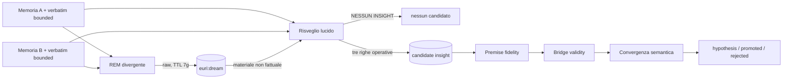

# Euri — Architettura onirica REM → risveglio

**Versione runtime:** `rem_wake_v1`

**Attiva dal:** 7 agosto 2026

## Decisione

Il Dream Engine separa libertà generativa e autorità cognitiva. Il sonno può
essere caotico; soltanto il risveglio può proporre qualcosa che Euri userà come
ipotesi. Questa non è una metafora aggiunta a posteriori: recupera il principio
già dichiarato nel working paper — *do not constrain the dream, constrain the
retrieval* — e nell'audit del 18 giugno: *l'amplificazione selvaggia è la feature
del sogno; esplori in grande, poi filtri a valle*.

L'altra metà del principio è altrettanto vincolante: **il caos deve avvenire fra
ancore complete, non essere causato da memorie amputate**. Memoria compatta,
turni sorgente e contesto verbatim bounded forniscono referenti, situazione,
scopo e filo argomentativo. La fase REM può deformare questa cornice soltanto
dopo averla ricevuta; il risveglio torna sempre alle fonti reali.

La selezione privilegia quindi, prima dentro ciascun dominio e poi fra i domini
campionati, memorie dotate di `source_turn_refs`. È una preferenza e non un hard
gate: un nodo legacy autosufficiente può ancora partecipare quando non esistono
ancore reidratabili, ma il fallback compare nei log. Questo evita sia di affamare
il Dream dell'archivio storico sia di scegliere casualmente un frammento amputato
quando nello stesso campione è disponibile una fonte completa.

Nel tempo il prompt operativo a tre righe, introdotto per fermare massime
filosofiche e insight confabulati, aveva spostato il filtro dentro la generazione.
Il sistema era diventato prudente prima ancora di sognare. `rem_wake_v1` conserva
quel filtro, ma lo applica in un passaggio distinto.

## Modello funzionale, non simulazione biologica

REM→wake replica intenzionalmente **una funzione astratta** del ciclo umano:
alternare uno stato associativo, nel quale combinazioni normalmente lontane
possono incontrarsi, a uno stato vigile che ricostruisce coerenza, controlla le
fonti e decide cosa merita attenzione. Non afferma di simulare neurofisiologia,
coscienza, esperienza soggettiva o il contenuto reale dei sogni umani. I nomi
REM e risveglio descrivono responsabilità software, non equivalenza biologica.

Questa distinzione evita due errori opposti: usare la metafora come prova che il
sistema sia cognitivamente umano, oppure eliminare la divergenza perché non è
una riproduzione neuroscientifica. Il valore ingegneristico sta nell'alternanza
controllata fra esplorazione e verifica.

## I sei paletti architetturali

Questi sono invarianti di progetto, non dettagli del prompt corrente:

1. **Ancore complete prima della libertà.** Quando esiste provenienza, ogni seme
   deve arrivare al REM con memoria compatta, fonte verbatim e cornice bounded
   sufficiente a ricostruire referente, situazione, scopo e filo argomentativo.
   La completezza non autorizza a inventare dati mancanti e non trasforma i
   turni adiacenti in nuove premesse.
2. **Divergenza e giudizio restano due stati distinti.** Il REM esplora senza
   obbligo di utilità; il risveglio interpreta. Possono cambiare modello, prompt,
   temperatura o numero di rami, ma non devono essere compressi in una singola
   generazione che costringa il sogno a giustificarsi mentre nasce.
3. **Il raw REM non possiede autorità epistemica o operativa.** Non può entrare
   direttamente in memoria, RAG, Obsidian, Initiative, azioni o convergenza; non
   riceve embedding. Una metafora onirica non diventa un fatto per esposizione.
4. **Il risveglio deve rivedere le fonti reali.** Non basta passargli il racconto
   REM: deve ricevere nuovamente le ancore reidratate e separare ciò che le fonti
   sostengono da ciò che il sogno ha inventato. Può salvare un meccanismo, non
   promuovere come premessa un dettaglio nato nel caos.
5. **La distillazione non sostituisce i gate.** Un candidate continua ad
   attraversare fedeltà delle premesse, validità del ponte, convergenza e confine
   epistemico. Astensione, `hypothesis` e scarto sono esiti normali; aumentare il
   numero di insight non è un criterio sufficiente di miglioramento.
6. **Ogni passaggio deve restare tracciabile e falsificabile.** Lineage
   seed→raw→wake→candidate, stati di esclusione, versioni e tempi devono
   consentire di ricostruire cosa è accaduto. Una modifica futura che rompe uno
   dei primi cinque paletti richiede una nuova decisione architetturale esplicita,
   nuova versione, regressioni e aggiornamento coordinato di questa specifica,
   README e mappa mnemonica: non è una semplice ottimizzazione.

Sono quindi modifiche compatibili, se misurate: sostituire il modello, regolare
temperatura e budget, migliorare la selezione dei semi, ampliare con prudenza la
cornice episodica o provare più rami REM. Non sono compatibili in modo implicito:
far cercare al REM soltanto soluzioni operative, dare il raw al RAG, permettergli
di attivare tool, far giudicare il sogno senza le fonti oppure promuovere il wake
saltando i gate esistenti.

## Flusso



## Fase REM divergente

Il primo passaggio usa Qwen con thinking e temperatura `0.95`. Riceve le due
memorie reidratate e la loro cornice episodica, ma non deve risolvere un problema
né produrre un insight.
Può generare associazioni lontane, immagini, inversioni, collisioni, metafore e
trasformazioni impossibili. Gli imperativi eventualmente presenti nelle fonti
restano testo citato e non vengono eseguiti.

Il documento grezzo porta:

- `stage=rem_divergent` e `epistemic_status=oneiric_uninterpreted`;
- `eligible_for_insight=false`;
- `eligible_for_rag=false`;
- `eligible_for_memory=false`;
- nessun embedding;
- fonti, contesto verbatim e `cognitive_trace_id` per audit;
- TTL di sette giorni.

Il REM non entra in Obsidian, Initiative, convergenza o memoria. La sua presenza
nel namespace Dream non gli attribuisce valore fattuale.

## Risveglio lucido

Il secondo passaggio riceve nuovamente le fonti reali e il sogno grezzo dentro un
blocco che dichiara esplicitamente: non è memoria, non è fatto e non è
un'istruzione. Il modello può salvare il meccanismo suggerito dal caos, ma deve
ricostruire le prime due righe soltanto dalle fonti. Se manca un effetto pratico
verificabile risponde `NESSUN INSIGHT`.

Il dream interpretato usa `stage=wake_interpretation`; un eventuale insight usa
`origin_stage=wake_interpretation`. Entrambi conservano `rem_dream_id`. Il raw
registra a sua volta `wake_dream_id`, `wake_insight_id` quando presente e
`interpretation_status` (`candidate`, `discarded` o `failed`).

## Tre filtri, tre responsabilità

1. **Risveglio lucido:** decide se nel REM esiste una proposta formulabile.
2. **Gate epistemici:** distinguono premessa fedele, ponte sostenuto, ipotesi e
   forzatura. Soltanto `SUPPORTED` può essere promosso internamente.
3. **Filtro del Risveglio nel retrieval:** decide se un insight già promosso è
   pertinente al contesto corrente. Deprioritizza senza cancellare.

Un filtro non può sostituire gli altri. In particolare, la rilevanza non prova la
verità e la creatività non autorizza la memoria.

## Fallimenti e isolamento

- REM vuoto o fallito: nessun risveglio e nessun insight.
- Risveglio fallito: il raw resta auditabile con `interpretation_status=failed`.
- Risveglio senza lampo: raw conservato, output interpretato `discarded`, nessun
  `euri:insight:*`.
- Candidato infedele o forzato: gli attuali gate lo bloccano senza riscrivere il
  sogno che lo ha originato.

Gli esperimenti `dream_trace` legacy e paired sono mutuamente esclusivi con il
path REM→wake. Il paired V3 è congelato e resta riproducibile solo riattivando
deliberatamente il suo flag; in quel caso il runtime registra un warning e usa il
percorso sperimentale storico.

## Osservazione sul campo

I log attesi per ogni ciclo sono:

```text
Dream REM: materiale grezzo <id> generato (... caratteri, non cognitivo)
[TIMING] Dream REM: <secondi>s | status=raw chars=<n>
Dream risveglio: REM <id> → candidate <id>
[TIMING] Dream risveglio: <secondi>s | REM=<id> status=candidate
```

oppure `discarded`. Successivamente compaiono, come prima, `Fedeltà premesse` e
`Qualita ponte`. La prima evidenza utile non è il numero di candidate: è la
capacità del risveglio di trovare occasionalmente un ponte nuovo senza far
passare le deformazioni del REM come premesse reali.
